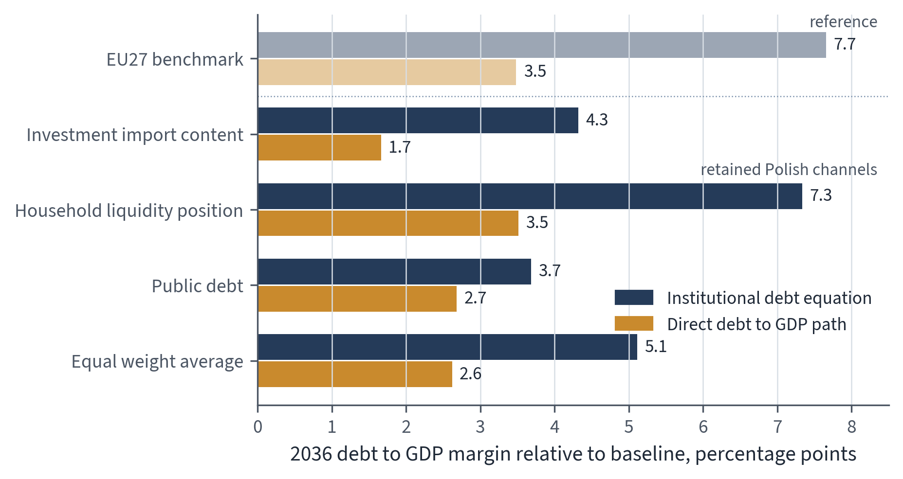

# Abstract

EU fiscal surveillance evaluates national budgets through debt projections and net expenditure ceilings. These assessments turn assumptions about growth, interest rates, fiscal multipliers, and the composition of adjustment into judgements about fiscal risk and required consolidation. Public investment is directly exposed to this logic because capital projects are often easier to postpone than raising taxes or reducing transfers, public wages, or entitlements. The analysis asks how estimated public investment responses change the debt implications of Polish investment policy. The empirical model estimates local projections for public investment shocks on an annual EU27 panel using data from the year of the EU's 2004 enlargement through 2025. The resulting output and spending paths are combined with two debt calculations: an institutional debt equation using the Commission baseline and a direct debt to GDP local projection path.

These paths are then used in both debt calculations to compare a symmetric investment expansion and cut, each changing annual public investment by one percentage point of GDP from 2028 to 2030. To avoid treating Poland as identical to the panel average, the estimated response paths are also conditioned on Polish values of investment import content, household liquidity position, public debt, and real GDP per capita in PPS. By 2036, public investment expansion reduces the debt to GDP ratio relative to the Commission baseline, while an equivalent investment cut, intended as consolidation, raises it by 3.7 to 7.3 percentage points across the retained Polish channel evaluations under the institutional debt equation, and by 1.7 to 3.5 percentage points under the direct debt to GDP path. The mechanism is self defeating: the discretionary primary balance gain from cutting investment is outweighed by persistent output losses, related cyclical primary balance deterioration due to automatic stabilisers, and the denominator effect on the debt ratio.

# 1 Introduction
## 1.1 EU fiscal surveillance and debt sustainability analysis

EU fiscal surveillance evaluates member states' fiscal plans by applying legal rules, numerical indicators, medium term adjustment trajectories, and model based assessments within the Stability and Growth Pact and the European Semester. This framework sets the institutional context in which the European Commission and the Council measure fiscal efforts and scrutinise national budgetary decisions (Schmidt, 2015; Van der Veer, 2021; European Commission, 2026). Recent reforms to the EU fiscal framework strengthen the role of debt sustainability analysis (Heimberger et al., 2024). Within the reformed framework, the Commission uses debt sustainability analysis in prior guidance, assessment of medium term budgetary plans, bilateral discussions with member states, and corrective trajectories where fiscal risks are considered significant (European Commission, 2026).

The institutional significance of the Commission's framework arises from its surveillance role. Structural balances, potential output, output gaps, projected debt paths, interest rate assumptions, growth forecasts, and fiscal multipliers are all model-dependent. When integrated into the surveillance model, adjustments to output gap estimates can alter the calculated structural balance and measured fiscal effort even without contemporaneous changes in taxes, expenditures, or headline budget balances. Heimberger, Huber and Kapeller (2020) show this within the Commission's potential output model: assumptions about production functions, labour input trends, and capacity utilisation affect output gap estimates, which in turn move structural deficit estimates and available fiscal space. Methodological decisions therefore shape surveillance assessments by shaping the evaluation of national fiscal plans.

The Debt Sustainability Monitor 2025 outlines the Commission's medium term projection methodology. It integrates Commission forecasts with assumptions about potential growth, output gap convergence, structural primary balances, inflation, interest payments, ageing-related expenditures, stock flow adjustments, deterministic stress scenarios, and stochastic risk analyses (European Commission, 2026). Macroeconomic feedback from fiscal interventions enters via GDP, cyclical budget elements, subsequent primary balance trajectories, and debt dynamics driven by the difference between interest rates and nominal growth. Within the reformed framework, these projections support prior fiscal guidance, assessments of medium term structural fiscal plans, Council approved net expenditure ceilings, annual progress evaluations, and corrective pathways under the excessive deficit procedure.

The excessive deficit procedure possesses institutional authority because non-compliance can trigger Council recommendations, assessments of effective action, revised fiscal adjustment trajectories, enhanced monitoring, and further escalation under the corrective arm (European Commission, 2026; Council of the European Union, 2025). Euro area member states are also subject to legal provisions allowing deposits or financial penalties (European Commission, 2026).

For Poland, which is outside the euro area, the relevant pressure therefore comes through Council approved adjustment requirements, annual surveillance, and procedural determinations regarding effective action, not through the euro area deposit or fine channel (Council of the European Union, 2025; European Commission, 2026; Ministry of Finance of Poland, 2025). A conditional legal channel persists: macroeconomic conditionality may affect access to cohesion policy funding (Sacher, 2019). Polish annual reporting under the excessive deficit procedure acknowledges potential restrictions on EU funds as a possible tightening channel if relevant expenditure path conditions remain unmet (Ministry of Finance of Poland, 2025).

Against this institutional background, the analysis uses the Commission's Debt Sustainability Monitor as the reference path. On that baseline, Poland's general government gross debt ratio rises from 55.1 percent of GDP in 2024 to 106.8 percent of GDP in 2036, above the 60 percent Treaty reference value (European Commission, 2026).

The baseline's own fiscal assumptions make it implausible as a policy path. It keeps a large primary deficit in place, with the primary balance at -3.9 percent of GDP at the 2036 endpoint, while the structural balance deteriorates to -9.9 percent of GDP. The initially favourable relation between interest rates and nominal growth also turns unfavourable during the projection period, so existing debt starts adding to the ratio rather than being eroded by nominal growth. Checherita-Westphal and Domingues Semeano (2020) state the standard debt stabilisation condition: the primary balance has to offset the effect of interest and growth on the existing debt stock. Applied to the Commission's 2036 debt ratio and 2036 interest and growth values, this condition implies a primary surplus of about one percent of GDP. The Commission baseline instead carries a primary balance of -3.9 percent of GDP at the same endpoint (European Commission, 2026).

## 1.2 Critical assumptions in debt projections and consolidation evidence

Empirical relationships used to justify consolidation policies, debt thresholds, and expenditure reductions must be reliable enough to support the policy conclusions drawn from them.

Dependence on critical assumptions extends beyond the Commission framework. Reinhart and Rogoff (2010) reported influential evidence associating elevated public debt with lower growth rates. Herndon, Ash and Pollin (2013) showed that those results were sensitive to data treatment, coding, country coverage, and weighting choices. Subsequent threshold analyses found no stable 90 percent debt threshold once sample selection, functional form, and model uncertainty were varied (Pescatori, Sandri and Simon, 2014; Egert, 2013). Survey and meta analytic evidence also cautions against treating observed debt and growth correlations as a one directional causal constraint on growth (Panizza and Presbitero, 2013; Heimberger, 2021). The controversy supports a cautious reading of debt ratios as growth constraints, especially where causal direction, functional form, and country coverage remain contested.

Such caution also applies to broad evidence on fiscal consolidation. In the expansionary austerity literature, multi year fiscal plans are often classified by their predominant tax or expenditure component, and subsequent macroeconomic outcomes are then read as evidence on the relative effects of those classes of adjustment (Alesina, Favero and Giavazzi, 2015). Aggregate plans differ from fiscal instruments, and plan labels differ from shocks. A plan classified as expenditure based can combine public consumption, transfers, public investment, procurement deferral, tax measures, and implementation changes. When consolidation is adopted under debt stress, weak growth, market pressure, or external surveillance, the conditions that select a country into treatment can also shape the macroeconomic path that follows. Guajardo, Leigh and Pescatori (2014) show that replacing conventional cyclically adjusted primary balance measures, abbreviated CAPB, with narratively identified deficit driven consolidation episodes reverses the main expansionary austerity conclusion and yields contractionary effects on private domestic demand and GDP. Adler, Allen, Ganelli and Leigh (2024) extend the action based dataset and restate the same identification concern: CAPB changes may reflect cyclical and asset price movements, or policy responses to prospective conditions, rather than deficit driven consolidation alone. Breuer (2019) adds a distinct reverse causality mechanism on the spending side, because rising output can mechanically reduce expenditure to GDP ratios when cyclical adjustment is incomplete. Broad consolidation evidence therefore cannot establish the dynamic causal effect of a specific expenditure instrument on output or debt.

Borys, Ciżkowicz and Rzońca (2013) are especially relevant because their panel of EU New Member States includes Poland. They define the EU New Member States as Bulgaria, the Czech Republic, Estonia, Hungary, Latvia, Lithuania, Poland, Romania, Slovakia, and Slovenia, observed over 1995-2011. They identify fiscal impulses through four procedures and estimate the response of output, output components, labour costs, and household confidence. Their broad finding is that expenditure based fiscal adjustments are relatively neutral for aggregate GDP growth, but are accompanied by faster private investment and export growth, wage moderation, and improved cost competitiveness. Expenditure based fiscal stimuli are associated with the opposite pattern, while private consumption and household confidence do not provide the main channel. It is therefore a substantive regional version of the expansionary austerity claim and has to be considered before asking whether it can support an argument for cutting public investment in Poland.

The claim weakens when the fiscal impulse has to be translated into a specific expenditure instrument. Borys, Ciżkowicz and Rzońca do not identify public investment shocks. Their indicators are aggregate measures: the CAPB, meaning the primary balance net of interest and adjusted for the business cycle; the underlying balance, meaning the CAPB further corrected for net capital transfers used as a proxy for one off operations; a simplified growth accounting measure associated with von Hagen; and a reduced action based indicator that records the sign, rather than the size, of legislated fiscal action. The authors state that the CAPB should be used with caution, citing IMF (2010). International Monetary Fund (2010), later extended by Guajardo, Leigh and Pescatori (2014), explains why this caution matters: cyclically adjusted balances can move because of asset price and revenue movements, one off operations, sharp recession effects, and policy responses to prospective cyclical conditions, even when those movements are not discretionary consolidation shocks. Breuer's (2019) critique concerns the narrower denominator problem in expenditure ratios, while Adler, Allen, Ganelli and Leigh (2024) develop the action based alternative in updated data. These are related but distinct objections to using broad fiscal balance indicators as causal shocks. None of the four identifiers used by Borys, Ciżkowicz and Rzońca separates public investment from public consumption, transfers, wages, procurement, or other current spending.

The timing problem reinforces the aggregation problem. Borys, Ciżkowicz and Rzońca explicitly acknowledge that their fiscal impulses may be insufficient to eliminate endogeneity bias, that an instrumental variables remedy is not used because of short sample bias, and that the results should be treated with caution because of the limited number of observations in panel estimation. For the present question, the problem is that weak growth, fiscal stress, market pressure, and external constraints can determine when consolidation occurs and also affect investment, exports, labour costs, and debt dynamics. Their substantive channels also delimit the inference. The estimated mechanisms run through private investment, exports, wage moderation, and cost competitiveness. They do not estimate the output effect of a public investment cut, trace public capital formation, or carry the output response into a debt to GDP denominator. The study therefore speaks to correlations between broad expenditure based impulses and private sector demand components in a transition economy panel; it does not provide direct evidence that reducing public investment improves debt dynamics.

For debt outcomes, the missing step is the output path that enters both the denominator and the revenue side of the debt ratio. Blanchard and Leigh (2013) show that European consolidation episodes were associated with systematic growth forecast errors consistent with underestimated fiscal multipliers. Fatas and Summers (2018) extend this logic to longer horizons and argue that fiscal consolidations can have persistent effects on actual and potential output, making debt reduction harder through a weaker denominator and lower revenues. Cugnasca and Rother (2015), using EU excessive deficit procedure recommendations as an instrument, find that consolidation multipliers vary substantially with cyclical conditions, openness, credit stress, and composition, and that non transfer spending reductions can be more costly than other adjustments. Heimberger et al. (2024) show, in the reformed EU fiscal rule setting, that debt sustainability analysis is sensitive to assumptions about multiplier size, persistence, and spillovers, and that public debt ratios may turn out higher when negative growth effects are underestimated. A measured improvement in the primary balance is therefore insufficient evidence of an improved debt path when the output response is large or persistent.

The effect of public investment cannot be inferred from an undifferentiated expenditure cut. Ardanaz, Cavallo, Izquierdo and Puig (2021) show that the macroeconomic effects of consolidation depend on whether public investment is protected or penalised relative to public consumption, and that private investment is the main component driving the difference between those adjustment strategies. This evidence is consistent with the wider multiplier literature reviewed below: public investment, public consumption, transfers, and taxes have different timing, persistence, import leakage, and public capital effects. Macroeconomic evaluations for Poland must therefore distinguish two questions. One concerns the fiscal rule itself: whether numerical debt and deficit indicators can assess an adjustment path without the surrounding macroeconomic setting. Grodzicki, Mozdzen and Zygmuntowski (2022) answer this critically, arguing that fiscal rules should be assessed together with growth, inflation, external balance, and balance of payments conditions. The other concerns the instrument used for adjustment, especially whether public investment is postponed, reduced, or spread over a longer period. Section 1.3 turns to that instrument question and to multiplier evidence on openness, exchange rate regimes, import content, and production structure.

## 1.3 Fiscal multipliers and instrument composition

The analysis focuses on one instrument, public investment. Higher public investment raises current demand, supports public capital formation, and expands future productive capacity. Reducing it improves the primary balance mechanically, but it also lowers output and shrinks the public capital stock. The literature on budget composition and fiscal rule design gives further reason to treat public investment on its own. Investment projects are easier to delay than transfers, wages, or entitlement programmes, and their economic costs are often less visible at the moment of budgetary decision making (Breunig and Busemeyer, 2012; Borge and Hopland, 2015; Pereira and Pinho, 2006; OECD, 2011). That makes public investment a particularly exposed adjustment item: projects can be postponed, scaled back, or trimmed through annual allocations. The design of fiscal rules also bears on whether investment spending is protected or curtailed during adjustment episodes (Ardanaz et al., 2020). The central analytical question is therefore how debt projections change when public investment expansion and public investment consolidation include estimated growth feedbacks, rather than relying only on a single short run multiplier applied directly to the structural primary balance.

The Commission's Debt Sustainability Monitor 2025 uses a common fiscal multiplier of 0.6 in the relevant fiscal policy scenarios. A 1 percentage point improvement in the structural primary balance reduces actual GDP growth by 0.6 percentage points in the same year, while potential growth is assumed to stay unchanged (European Commission, 2026). The multiplier reaches the debt ratio through two channels. Lower GDP mechanically raises the debt to GDP ratio by shrinking the denominator, and weaker activity shifts the cyclical component of the budget balance, which then feeds into the primary balance path. The Debt Sustainability Monitor framework also applies a specified output gap closure rule. The Commission recognises that multipliers vary with structural characteristics, cyclical conditions, monetary policy settings, policy instruments, and the composition of adjustment, and it lets member states justify different values in their own plans. Even so, the operational simplification remains a common value used for prior guidance across countries.

An instrument specific question requires more than a common multiplier. Public investment, public consumption, transfers, and taxes have different dynamic effects. Multipliers vary by openness, exchange rate regime, public capital stock, fiscal position, monetary accommodation, and horizon (Ilzetzki, Mendoza and Vegh, 2013; Ramey and Zubairy, 2018; Cloyne, Jorda and Taylor, 2023). Evidence for Poland and for cross country samples already documents this heterogeneity.
Table 1. Polish multiplier evidence used to motivate instrument specific estimation.

| Source | Fiscal measure | Reported multiplier values |
|---|---|---|
| Ministry of Finance of Poland, Medium Term Fiscal Structural Plan 2025-2028 | NEMPF effective consolidation multiplier and one year category multipliers | Effective consolidation multiplier: 0.449 in 2026, 0.498 in 2027, 0.528 in 2028; one year category multipliers: total expenditure 0.788, public investment 1.493. |
| Haug, Jedrzejowicz and Sznajderska (2019) | Government spending in Poland | Impact 0.70; four quarters 1.13; eight quarters 1.46; peak 1.61 after fourteen quarters. |
| Sznajderska (2025) | Fiscal policy shocks in Poland | Impact spending multiplier 1.25; long run cumulative spending multiplier 1.04; impact tax multiplier -1.18. |
| Haug, Lyziak and Sznajderska (2025) | Local projection IV government spending in Poland | Peak cumulative linear multiplier 1.53 after six quarters; pre-Covid peak 1.38 after eight quarters. |

Note: The negative tax multiplier follows the standard sign convention for a positive tax shock: higher taxes reduce output.

Table 2. Cross country and European multiplier evidence used to motivate instrument specific estimation.

| Source | Fiscal measure or conditioning dimension | Reported multiplier values |
|---|---|---|
| Ilzetzki, Mendoza and Vegh (2013) | Government consumption, high income countries | Impact 0.39; long run 0.66. |
| Ilzetzki, Mendoza and Vegh (2013) | Openness and exchange rate regime | Closed economies: impact 0.61, long run 1.10; open economies: impact -0.077, long run -0.46; fixed exchange rates: long run about 1.4; flexible exchange rates: long run about -0.69. |
| Ilzetzki, Mendoza and Vegh (2013) | Pure government investment shocks | High income countries: impact 0.39, long run 1.5; developing countries: impact 0.57, long run 1.6. |
| IMF Working Paper 2019/289 | Public investment and initial public capital stock | Public investment: impact 0.15, two years 0.80; low initial public capital: two years 2.15; high initial public capital: two years 0.15. |
| Ciaffi, Deleidi and Capriati (2024) | Government spending in OECD countries; linear and high public debt states | Linear model: impact 0.72, five year 0.87; high debt cases: impact 0.64 to 0.80, five year 1.51 to 1.56. |
| Gechert and Will (2012) | Meta regression by fiscal instrument | Reported means: general public spending 1.0; public investment 1.2; transfers 0.4; taxes 0.6. |
| Saccone (2022) | Public investment in European countries | Total public investment: 0.979 on impact and 2.056 at horizon 6; economic affairs investment: 0.859 on impact and 2.336 at horizon 6. |

The tables show that Polish official planning and the wider multiplier literature already distinguish fiscal instruments, reporting values that vary by horizon, instrument, and conditioning environment. This public investment evidence is what motivates estimating that instrument separately and carrying its output path into the debt assessment.

The remainder is organised as follows. Section 2 presents the data, fiscal shock construction, and local projection methodology. Section 3 reports the estimated response trajectories. Section 4 applies them to public investment expansion and consolidation scenarios for Poland. Section 5 concludes. The appendices are organised sequentially to build from raw inputs to final results: Appendix A defines the state variables and reports the diagnostic screening; Appendix B reports the full cumulative response paths; Appendix C reports the annual debt to GDP projection paths; and Appendix D details the underlying local projection coefficient estimates, standard errors, and p values.

# 2 Data and empirical strategy
## 2.1 Local projection framework

Local projections estimate dynamic responses by running a separate regression at each horizon after a policy intervention or shock. The outcome dated $t+h$ is regressed on the shock dated $t$ conditional on controls, and the resulting sequence of horizon specific coefficients traces the impulse response. The approach follows Jorda (2005) and the later local projection literature, which recovers impulse responses directly and does not impose the full dynamic restrictions of a vector autoregression (Jorda and Taylor, 2024). For fiscal multiplier analysis the method is well suited, since the estimate depends on the shock definition, the fiscal instrument, the horizon, and the conditioning information set (Ramey and Zubairy, 2018; Ramey, 2019).

The public investment shock is identified before the local projection regressions are estimated, because a change in public investment is not automatically a policy shock. Public investment growth may reflect current activity, common funding cycles, interest rate conditions, project completion, or planned procurement rather than an exogenous fiscal impulse. The recursive system therefore isolates the unexplained movement in public investment under a timing restriction, and the local projections then estimate how that identified innovation propagates across horizons. This separation between shock identification and response estimation follows the fiscal shock literature: Blanchard and Perotti (2002) identify fiscal shocks before tracing their macroeconomic effects; Jorda (2005) estimates horizon responses directly once the treatment variable is defined; Ramey (2019) and Ramey and Zubairy (2018) stress that multiplier estimates depend on the shock measure; and Ciaffi, Deleidi and Di Domenico (2024) first identify public investment shocks and then insert them into local projections. The same separation carries over here to an annual EU27 panel and to Polish state evaluation.

The first step estimates a system containing public investment growth, public consumption growth, output growth, and the short term interest rate. Public investment is ordered first in the recursive timing structure. This follows the fiscal shock literature, which treats public investment as relatively predetermined within the year because large investment decisions are shaped by multiannual political, administrative, and procurement processes (Ciaffi, Deleidi and Di Domenico, 2024; Ciaffi, Deleidi and Mazzucato, 2024). Under this timing restriction, output, public consumption, and the interest rate may respond within the same year to the public investment movement, while public investment does not respond contemporaneously to those variables. What remains of public investment growth, the part the system leaves unexplained, is then used as the public investment shock in the local projections.

The source data are annual EU27 series beginning in 2004. Where a variable is available through 2025, the 2025 observation enters the source and state-profile work. The local projection estimation uses horizon specific samples, so the eighth-year sample uses 2004-2017 observations while shorter horizons use later years. A Poland only annual regression would provide too few observations since 2004 to estimate controlled dynamic responses through the eighth year, and too little variation to assess how fiscal transmission changes with country characteristics. The EU27 panel supplies variation across countries and time while keeping the estimation inside the institutional setting relevant for Poland's fiscal surveillance. Country fixed effects absorb persistent cross country differences, and year fixed effects absorb common yearly disturbances. The linear EU27 specification estimates a common public investment response conditional on fixed effects and lagged controls. Poland is evaluated later through interactions between the public investment shock and Poland's observed state values.
For each horizon $h\in\{0,\ldots,8\}$, the baseline linear local projection is

$$
y_{i,t+h}=\alpha_i^h+\tau_t^h+\beta_h s^{GI}_{i,t}
+\gamma_h s^{GC}_{i,t}+\Gamma_h' W_{i,t-1}+u^h_{i,t+h}.
$$

Here $i$ indexes EU27 member states and $t$ indexes years. The dependent variable $y_{i,t+h}$ is the scaled outcome at horizon $h$: real GDP in output regressions and public investment spending in spending regressions. The term $s^{GI}_{i,t}$ is the identified public investment shock, while $s^{GC}_{i,t}$ is the identified public consumption shock included as a fiscal control. The lagged controls match the fiscal, output, and monetary variables used in the recursive shock-identification system, following the practice of conditioning local projections on pre shock dynamics in the relevant information set (Jorda, 2005; Ciaffi, Deleidi and Di Domenico, 2024).

The vector $W_{i,t-1}$ contains lagged public investment growth, lagged public consumption growth, lagged output growth, and the lagged short term interest rate. The terms $\alpha_i^h$ and $\tau_t^h$ denote country and year fixed effects. The coefficient $\beta_h$ is therefore the common linear EU27 response to the public investment shock at horizon $h$, conditional on fixed effects, the public consumption shock, and lagged controls.
The linear specification imposes the same marginal response across the panel once these controls are in place. To see how that response changes with country characteristics, the analysis also estimates state dependent local projections. The approach follows the interaction logic in Cloyne, Jorda and Taylor (2023), where the effect of a policy intervention can vary with observed information from before the shock year. It sits alongside the fiscal multiplier literature, in which responses vary with macroeconomic conditions and policy settings (Ramey and Zubairy, 2018). Here the state variables are continuous predetermined characteristics rather than binary recession expansion indicators.

For each individual transmission channel $c$, the state dependent specification is
$$
y_{i,t+h}=\alpha_i^h+\tau_t^h+\beta_{c,h} s^{GI}_{i,t} + \theta_{c,h}(s^{GI}_{i,t} z_{c,i,t-1}) + \lambda_{c,h} z_{c,i,t-1} + \gamma_{c,h} s^{GC}_{i,t} + \Gamma_{c,h}' W_{i,t-1} + u^h_{i,t+h}.
$$
The scalar $z_{c,i,t-1}$ is the lagged standardised value of one predetermined state variable. Because the state variable is standardised, the coefficient $\beta_{c,h}$ gives the public investment response for a country at the sample mean of that channel. The interaction coefficient $\theta_{c,h}$ shows how the response changes when a country's state value departs from that mean. The term $\lambda_{c,h}$ lets the same state variable enter the outcome equation directly, separately from its interaction with the public investment shock. The public consumption shock, lagged controls, and fixed effects are the same as in the linear specification. Poland's evaluation comes from applying its observed standardised value for channel $c$ to the estimated interaction structure. Poland's evaluated response is therefore generated within the state dependent fixed effects local projection by the mean state coefficient $\beta_{c,h}$ together with the interaction term $\theta_{c,h}z_{c,PL,t-1}$.

In short, the identified shocks enter horizon specific local projections as regressors. This shock-identification-plus-local projection structure follows Ciaffi, Deleidi and Di Domenico (2024), and the present paper adapts it to an EU27 annual panel and to the evaluation of Polish state variables.

The state variables used in the interaction terms are lagged and standardised on the EU27 panel, as defined in Section 2.2. Appendix A reports the state variable definitions and the eighth year output interaction selection rule used for the Polish evaluations.

Section 2.4 sets out the main limitations of this empirical design after the state variable definitions and the channel retention criterion.

## 2.2 State variables

State dependent local projection research provides the methodological rationale for this structure: a pooled panel can estimate an average response while allowing that response to vary with observed state variables (Cloyne, Jorda and Taylor, 2023). The fiscal multiplier literature applies the same logic to country characteristics. Ilzetzki, Mendoza and Vegh (2013) examine heterogeneity by development level, exchange rate regime, trade openness, and public indebtedness; Huidrom, Kose, Lim and Ohnsorge (2019) focus on initial fiscal position, measured by government debt, as a source of multiplier variation through private demand responses and financing cost channels. This section defines the country characteristics that condition how fiscal shocks propagate within the EU27 panel. The four structural state variables are investment import content, public debt, household liquidity position, and real GDP per capita in PPS.

Investment import content captures openness and import leakage mechanisms in fiscal transmission (Ilzetzki, Mendoza and Vegh, 2013). Public debt captures the fiscal position channel (Huidrom, Kose, Lim and Ohnsorge, 2019). Household liquidity position captures household financial buffer mechanisms (Kaplan, Violante and Weidner, 2014). Real GDP per capita in PPS captures development level heterogeneity in multiplier estimates (Ilzetzki, Mendoza and Vegh, 2013; Huidrom, Kose, Lim and Ohnsorge, 2019). Each state variable is defined before estimation and measured on harmonised cross country data, consistent with a state dependent local projection design that keeps conditioning information interpretable and predetermined (Cloyne, Jorda and Taylor, 2023).

In the regression framework, a state variable is a predetermined country characteristic that interacts with fiscal shocks and summarises the setting in which fiscal transmission occurs. It is recorded before the shock year and is not part of the response trajectory after the shock. This distinction follows Cloyne, Jorda and Taylor's (2023) separation between treatment, conditioning state, and dynamic propagation. It also matches fiscal position research that treats initial fiscal conditions as possible determinants of multiplier strength rather than as outcomes of fiscal policy (Huidrom, Kose, Lim and Ohnsorge, 2019). The investment import content data come from the OECD TiVA database released in 2025. In the source used here, official measurements of domestic value added shares in gross fixed capital formation run through 2022, so the common TiVA state window is 2004 to 2022.

The operational definitions are standardised before Section 2.3 reports the baseline Polish profile. Table 2a reports each variable's measurement, observation count, standardisation moments, and Poland's value before and after standardisation. Investment import content uses official OECD TiVA observations through 2022. The public debt, household liquidity position, and real GDP per capita in PPS variables use Eurostat observations through 2025. In the current Eurostat vintage, the 2025 household financial accounts inputs used for household liquidity are observed for all EU27 countries.

\TableBlock

Table 2a. State variable measurement and Polish profile, Panel A: definitions.

| State variable | Measurement | Non-missing observations | Source window used |
| --- | --- | ---: | --- |
| Investment import content | One minus OECD TiVA domestic value added share of gross fixed capital formation | 513 | Official TiVA through 2022; Poland profile uses the latest official TiVA value |
| Public debt | Maastricht gross debt, percent of GDP | 594 | Eurostat through 2025 |
| Household liquidity position | Negative household net financial worth divided by GDP | 594 | Eurostat through 2025 |
| Real GDP per capita in PPS | Log real GDP per capita in 2020 PPS terms | 594 | Eurostat through 2025 |

\CompactTableBlock

Table 2a continued. State variable measurement and Polish profile, Panel B: standardisation and Poland values.

| State variable | EU27 mean | EU27 standard deviation | Poland value | Poland standardised value |
| --- | ---: | ---: | ---: | ---: |
| Investment import content | 0.429 | 0.101 | 0.413 | -0.161 |
| Public debt | 62.658 | 36.311 | 59.700 | -0.081 |
| Household liquidity position | -1.137 | 0.598 | -0.793 | 0.575 |
| Real GDP per capita in PPS | 10.237 | 0.380 | 10.265 | 0.074 |

Investment import content enters because an investment shock raises domestic output only to the extent that the spending is met by domestic value added rather than imports. The measure uses the OECD TiVA domestic value added share of gross fixed capital formation, and import content is one minus that share. A higher value therefore means that more of the investment demand leaks into imports instead of domestic value added. This state links the investment channel to the openness mechanism in the fiscal multiplier literature (Ilzetzki, Mendoza and Vegh, 2013; Cacciatore and Traum, 2020).

Public debt enters as a fiscal position state. Ilzetzki, Mendoza and Vegh (2013) identify public indebtedness as a country characteristic relevant for fiscal multiplier heterogeneity, while Huidrom, Kose, Lim and Ohnsorge (2019) link fiscal positions to interest rate and risk premium channels. Debt therefore has two roles. In Section 2, the public debt ratio is a fiscal position characteristic measured before the shock year and conditioning the estimated output response. In Section 4, the future debt ratio path is the outcome generated by the scenario analysis.

Public debt is measured as Maastricht general government gross debt relative to GDP. The Maastricht debt ratio is used here only as a fiscal position state measured before the shock year. This conditioning state can influence fiscal transmission through risk premia and the interest rate and growth dynamics that govern debt sustainability (Blanchard, 2019; Huidrom, Kose, Lim and Ohnsorge, 2019). It also enters the official domestic and EU fiscal rule assessments framing the adjustment path (Ministry of Finance of Poland, 2024; European Commission, 2026).

Household liquidity position is measured from financial accounts as the negative of household financial assets net of liabilities, divided by GDP. The numerator excludes non financial assets, including housing, and the measure is transformed so that higher values indicate a weaker liquidity position relative to GDP. The variable captures the household financial buffer channel, since fiscal shocks may propagate differently when households have limited net financial capacity to smooth consumption after income fluctuations. Kaplan, Violante and Weidner (2014) provide the microeconomic distinction between liquid resources and illiquid wealth that motivates treating liquid household resources as relevant for consumption smoothing. Bernardini, De Schryder and Peersman (2017) show that household leverage conditions the transmission of fiscal shocks through balance sheet positions. Krajewski and Pilat (2025) give the Polish household finance context in which liquidity constraints and financial buffers are empirically relevant. The EU27 measure used here is therefore a comparable macro financial accounts state, not a direct household survey measure of liquid deposits.

Real GDP per capita in PPS is defined as the logarithm of real GDP per capita, expressed in 2020 purchasing power standard terms. Its role is to capture heterogeneity in development levels, market structures, relative price environments, and broader macroeconomic conditions. Ilzetzki, Mendoza and Vegh (2013) explicitly examine multiplier differences between high income and developing economies, while Huidrom, Kose, Lim and Ohnsorge (2019) similarly link multiplier variation to structural factors and macro financial conditions.

These four state variables form the state variable set because each has a direct economic interpretation and is defined before estimation. The set is deliberately parsimonious. Cloyne, Jorda and Taylor (2023) note the value of keeping the state space interpretable, while Ilzetzki, Mendoza and Vegh (2013) and Huidrom, Kose, Lim and Ohnsorge (2019) motivate multiplier heterogeneity through clearly defined country characteristics. The framework therefore evaluates four individual transmission channels specified in advance rather than searching across an unrestricted set of conditioning variables.

Unemployment and the output gap belong to the cyclical state dependence literature rather than to the slower moving structural conditioning variables used here. Auerbach and Gorodnichenko (2012, 2013) and Ramey and Zubairy (2018) study fiscal multiplier differences between slack and expansion states, a distinct cyclical approach to state dependent fiscal transmission. The analysis instead works with slower moving structural heterogeneity across EU27 economies. The narrower scope also reduces contemporaneous state endogeneity concerns, since unemployment and the output gap can move at the same time as fiscal shocks and output responses (Cloyne, Jorda and Taylor, 2023). The analysis therefore focuses on structural conditioning variables, while recession and expansion asymmetries remain a separate analytical design.

## 2.3 Channel retention criterion and diagnostics

Section 2.2 defined the four channels and the reasons for evaluating them one at a time. This subsection sets out the criterion that decides which channels are carried into the Polish scenario. Within the finite annual EU27 panel, the design gives the coefficients a direct interpretation as distinct economic channels.

Each channel evaluation must meet several conditions: the local projection must be estimable, exhibit acceptable numerical stability, include Poland within the observed EU27 data range, have viable output and spending denominators, and show an eighth year output interaction at $p \leq 0.10$. The eighth year is selected as the diagnostic horizon because it directly informs the cumulative response comparison and the debt translation.

The design applies empirical discipline to state dependent local projections. Relevant conditioning dimensions can matter for the completeness of interaction effects, while estimating several interaction dimensions at once can weaken empirical support, produce unstable estimates, and place too much weight on a limited number of country year observations (Cloyne, Jorda and Taylor, 2023). The design therefore separates the a priori definition of the state variable set from the statistical decision to carry a channel into the debt scenario. The resulting estimates should be read as individual channel evaluations, not as a model of simultaneous interaction among all macroeconomic states.

Four individual channel evaluations are conducted. Investment import content, household liquidity position, and public debt each satisfy the eighth year output interaction criterion, with p values of 0.002, 0.003, and 0.080. Real GDP per capita in PPS, however, does not meet this criterion (p value of 0.461) and is therefore excluded from the Polish scenario projections. Table 2b reports the full retention decision behind the primary response and subsequent debt analysis.

A joint interaction including all four candidate state variables does not satisfy the same response relevance screen. Its eighth year output interaction p value is 0.179, above the 0.10 threshold. The main scenario therefore keeps the three retained individual channel evaluations rather than replacing them with a joint four state interaction surface.

\TableBlock

Table 2b. Full retention screen for all four Polish channel evaluations.

| Polish channel evaluation | Eighth year output interaction p value | Polish standardised state value | Scenario status |
| --- | ---: | ---: | --- |
| Investment import content | 0.002 | -0.161 | Retained |
| Household liquidity position | 0.003 | 0.575 | Retained |
| Public debt | 0.080 | -0.081 | Retained |
| Real GDP per capita in PPS | 0.461 | 0.074 | Not retained |

Notes: The retention criterion is an eighth year output interaction p value of $p \leq 0.10$. In the investment import content evaluation, Poland is slightly below the EU27 mean import content value for gross fixed capital formation. In the household liquidity position evaluation, Poland is above the EU27 mean of the transformed household liquidity state, indicating weaker net financial worth relative to GDP under the sign convention used here. In the public debt evaluation, Poland is slightly below the EU27 mean Maastricht public debt ratio in the mixed window state profile. Real GDP per capita in PPS remains part of the state variable set specified in advance but is not carried into the main scenario.

Appendix A reports the state variable definitions and the statistical screening results for all four individual channels. Real GDP per capita in PPS belongs to the set of state variables specified in advance, but it is not retained because its eighth year output interaction does not satisfy the stated criterion. Section 3 therefore reports empirical response paths for the linear EU27 benchmark and for the three retained Polish channel evaluations. Appendix D reports the coefficient level estimation output behind these paths: horizon specific shock coefficients, interaction coefficients, standard errors, p values, observation counts, country counts, year ranges, fixed effects, and the covariance estimator. These diagnostics describe coefficient level precision and are distinct from any full path confidence interval for the debt translation.

## 2.4 Limitations of the empirical design

The empirical strategy has several limitations that should be read together with the response paths in Section 3 and the debt translation in Section 4. First, the local projections estimate conditional dynamic responses to recursively identified public investment shocks. The identifying variation thus relies on the maintained within year timing restriction that orders public investment before contemporaneous output, public consumption, and the short term interest rate. Local projections are transparent and flexible, yet they can be less smooth and less efficient than a correctly specified dynamic system, and horizon specific estimates should not be read as a fully specified structural model of fiscal policy (Jorda, 2005; Jorda and Taylor, 2024).

Second, state dependence is evaluated through individual channels specified in advance rather than through a joint interaction surface. This maintains interpretability of the state space, but it also means that import leakage, fiscal position, household liquidity, and development level are evaluated as separate conditional paths. They are not estimated within a model in which all macroeconomic states interact simultaneously. Cloyne, Jorda and Taylor (2023) treat interaction structure as central to impulse response heterogeneity, while also warning that richer state spaces raise identification and interpretation demands. In this finite EU27 annual panel, jointly estimating all interactions would weaken empirical discipline, increase instability, and place too much weight on limited country year observations. The reported paths should therefore be read as partial channel evaluations rather than as a complete interaction surface for fiscal transmission.

Third, the sample defines the inference scope. The panel begins in 2004, using annual EU27 variation, since a Poland only annual regression would lack sufficient observations to estimate controlled dynamic responses through the eighth year. Polish paths are therefore EU27 panel estimates evaluated at Polish state values rather than Poland specific time series estimates. Support and diagnostic checks mitigate extrapolation risk but do not transform panel heterogeneity into a country specific natural experiment (Cloyne, Jorda and Taylor, 2023).

Fourth, the horizon structure is finite. The eighth year diagnostic horizon is used because it feeds the cumulative response comparison and debt translation, yet it remains a deliberate design choice. The reported local projections do not estimate effects beyond the eighth year and do not imply zero effects after this horizon. Horizon specific leads also shorten the usable sample at longer horizons, so the eighth year evidence relies on the shorter 2004-2017 estimation window, while shorter horizons draw on more recent observations. This limitation affects the interpretation of persistence but does not alter the reported response values, the stated retention rule, or the scenario arithmetic.

# 3 Results

## 3.1 EU27 panel benchmark and Polish evaluations within the EU27 panel

The results section first reports cumulative output responses to public investment, because the debt exercise in Section 4 uses the estimated output paths as inputs.

For each horizon $h$, $K_Y(h)$ denotes the cumulative real GDP response through horizon $h$ to the identified public investment shock. The corresponding $K_G(h)$ denotes the cumulative movement in public investment spending generated by the same shock. The distinction matters because Section 4 states the scenario as a policy action equal to one percentage point of GDP in each of three years, while the empirical model estimates the output and spending paths that follow the identified public investment innovation. $K_G(h)$ translates the estimated shock into the scale of the stated fiscal action; $K_Y(h)$ carries the resulting output feedback into the debt calculation. The two series need not move together. Public investment spending can rise on impact and then partly unwind, while output can persist through demand, capacity and balance sheet channels.

The ratio $K_Y(h)/K_G(h)$ is therefore the cumulative output response per cumulative unit of public investment spending, the multiplier concept closest to the fiscal multiplier literature (Ilzetzki, Mendoza and Vegh, 2013; Ramey and Zubairy, 2018; Ciaffi, Deleidi and Di Domenico, 2024). This ratio is the relevant comparison object for a multiplier such as the Commission's 0.6, but the comparison only orients: the Commission value is a one year GDP growth response to a structural primary balance change, whereas $K_Y(h)/K_G(h)$ is an eighth year cumulative investment spending ratio. Table 3 reports $K_Y(h)$, $K_G(h)$, and $K_Y(h)/K_G(h)$ through the eighth annual horizon for the EU27 panel benchmark, the three Polish debt-scenario channel evaluations carried into the main scenario, and their equal weight arithmetic average.

\TableBlock

Table 3. Eighth year cumulative output and spending responses for public investment.

| Path | Evaluation basis | $K_Y(8)$ | $K_G(8)$ | $K_Y(8)/K_G(8)$ | Role |
| --- | --- | ---: | ---: | ---: | --- |
| EU27 benchmark | Fixed effects panel, no state interactions | 2.23 | 0.78 | 2.87 | EU27 reference |
| Investment import content | Poland's TiVA investment import content profile | 1.80 | 0.73 | 2.47 | Import leakage evaluation |
| Household liquidity position | Poland's household financial accounts liquidity profile | 2.24 | 0.77 | 2.91 | Household liquidity position evaluation |
| Public debt | Poland's Maastricht public debt profile | 1.78 | 0.75 | 2.37 | Fiscal position evaluation |
| Equal weight average | Arithmetic average of the three Polish debt-scenario paths | 1.94 | 0.75 | 2.59 | Section 4 summary path |

Notes: The output and spending responses are cumulative response units under the public investment shock normalization. Positive output values mean output above the no shock path. The ratio divides the eighth year cumulative output response by the eighth year cumulative spending response. Rounded ratios correspond to Appendix B, Table B.3.

The EU27 panel benchmark gives an eighth year cumulative output response of 2.23. This is the panel average response after conditioning on country and year fixed effects and the lagged controls in the linear specification. Because the linear specification imposes a common slope on the public investment shock, the estimate serves as an EU27 benchmark, not as a Poland specific response.

The investment import content evaluation for Poland results in an eighth-year cumulative output response of 1.80. Poland's evaluated import content stands slightly below the EU27 panel mean, with a raw value of 0.413 against the EU27 mean of 0.429, and a standardised value of -0.161. This comparison with the EU27 benchmark is not a mechanical, single-variable exercise. Within the investment import content specification, Poland's below-average state value increases the eighth-year output response relative to the same specification evaluated at the EU27 mean. Conversely, the EU27 benchmark reflects a distinct linear panel response without state interactions. The Polish investment import content trajectory initially runs above the EU27 benchmark, then falls below it from the third horizon onward. Consequently, the 2036 debt endpoint for Poland is less self-defeating than the EU27 benchmark, although it remains self-defeating under a cut.

This pattern aligns with the trade multiplier literature. Import leakage and the exchange-rate regime influence the magnitude of fiscal multipliers (Ilzetzki, Mendoza and Vegh, 2013). Trade-flow analysis associates fiscal transmission with the relative import content of public and private expenditure, financing, and invoicing conditions (Cacciatore and Traum, 2020). Evidence from production structures further links multiplier size to tradability and domestic value-added content (Crespo Cuaresma and Glocker, 2023).

The evaluation of household liquidity position for Poland yields an eighth-year cumulative output response of 2.24. Here, Poland is evaluated through the household sector's net financial balance-sheet position rather than a direct measure of credit flows. The state thus captures a financial accounts balance-sheet channel. Kaplan, Violante and Weidner (2014) distinguish liquid resources from illiquid wealth in household consumption smoothing, while Bernardini, De Schryder and Peersman (2017) show that household leverage conditions the transmission of government spending shocks through balance-sheet positions. Fiscal shocks can therefore propagate differently when household financial assets net of liabilities are comparatively weaker relative to GDP.

The public debt Polish evaluation gives an eighth year cumulative output response of 1.78. Here the conditioning state is the Maastricht public debt ratio measured before the shock year. Poland's evaluated public debt state is slightly below the EU27 mean, with a standardised value of -0.081. This path captures heterogeneity by fiscal position in the estimated transmission of public investment shocks, and it is distinct from the later debt ratio outcome in Section 4.

The equal weight average across the three Polish debt-scenario evaluations is 1.94 in the eighth year.

## 3.2 Persistence and shape of the output responses across horizons

Section 3.1 reported eighth year cumulative output responses for the EU27 panel benchmark, the three Polish debt-scenario evaluations, and their equal weight average. Those values are endpoints of full cumulative response paths. This subsection follows $K_Y(h)$, the cumulative output response at horizon $h$, from impact through the eighth year.

Figure 1 plots the full sequence. At each horizon, $K_Y(h)$ is the cumulative real GDP response under the public investment shock normalization used here. The figure includes the EU27 benchmark, the three Polish debt-scenario evaluations, and the equal weight Polish average.

The estimated paths stay positive throughout the reported horizon. They rise strongly in the first two years, moderate across the middle horizons, and rise again by the eighth year. The sign matters for the scenario application: for an equal public investment cut, the same response paths imply a persistent output loss rather than a transitory impact effect. In the eighth year, the investment import content Polish evaluation reaches 1.80. The household liquidity position evaluation reaches 2.24, and the public debt evaluation reaches 1.78. Their equal weight average is 1.94.

Table 4 reports selected horizons from the same paths, and Appendix B reports the full values at each horizon.

\CompactTableBlock

Table 4. Selected values of $K_Y(h)$.

| Empirical path | $h=0$ | $h=2$ | $h=5$ | $h=8$ |
| --- | ---: | ---: | ---: | ---: |
| EU27 panel benchmark | 1.16 | 2.24 | 1.83 | 2.23 |
| Polish evaluation based on investment import content | 1.38 | 2.27 | 1.28 | 1.80 |
| Polish evaluation based on household liquidity position | 1.18 | 2.37 | 1.76 | 2.24 |
| Polish evaluation based on public debt | 1.13 | 2.03 | 1.46 | 1.78 |
| Equal weight average across the three Polish debt-scenario paths | 1.23 | 2.22 | 1.50 | 1.94 |

The selected horizons show that the EU27 benchmark and the equal weight Polish average remain close in the eighth year, while the three Polish debt-scenario evaluations differ in magnitude. In the eighth year, the investment import content response is 1.80, the household liquidity position response is 2.24, and the public debt response is 1.78. The average summarizes the Polish debt-scenario evaluations, but it does not remove the difference among the import leakage, household liquidity, and fiscal position channels.

The main implication is persistence over the observed local projection horizon. The estimated response extends beyond the impact year: cumulative output responses stay positive through the eighth year, and the later values are still economically material. For an expansion, persistence raises output during the years in which the debt ratio is assessed. For an equal cut, reversing the sign of the public investment action turns the same response path into a sustained output shortfall. The hysteresis literature gives the economic reason this persistence is not cosmetic. Demand shortfalls can reduce investment and future productive capacity in debt-dynamics models with depressed-economy effects (DeLong and Summers, 2012), fiscal consolidation can have permanent output effects (Fatas and Summers, 2018), and demand weakness can generate hysteresis through labour-market and capital-formation channels (Engler and Tervala, 2016; Gechert, Horn and Paetz, 2019).

# 4 Application to Polish public investment scenarios

## 4.1 Scenario design

Polish public investment is positioned at the intersection of national development planning, EU fiscal surveillance, and discretionary political decisions about project implementation. Poland's medium term fiscal structural plan revolves around a defined net expenditure trajectory extending to 2028. Official Polish documents indicate that Poland has been under the excessive deficit procedure since July 2024. Evaluations under this procedure focus on adherence to the recommended expenditure path and track progress on reforms and investments explicitly aligned with EU priorities (Ministry of Finance of Poland, 2024, 2025; European Commission, 2026). The institutional challenge arises from two factors: the overall magnitude of the fiscal balance and the composition of budgetary adjustments. This challenge intensifies when multiannual investment commitments span several budget cycles under a surveillance framework that closely examines expenditure growth and debt trajectory forecasts.

The Centralny Port Komunikacyjny (CPK) illustrates how a programme can maintain formal continuity while experiencing a significant decline in annual investment intensity. The 2023 programme established the CPK investment framework for 2024-2030, with a State Treasury engagement cap set at PLN 66.2 billion (Council of Ministers of Poland, 2023). The revised programme preserves the inclusion of CPK in official planning but extends the active framework to 2024-2032, reduces the State Treasury engagement limit to PLN 62.9 billion, and sets total financing at PLN 131.7 billion (Council of Ministers of Poland, 2024b; Centralny Port Komunikacyjny, 2025). Compared to the initial PLN 155.1 billion total, the revised plan reduces the envelope to PLN 131.7 billion, extends the timeline by two years, and lowers the maximum annual State Treasury bond engagement from over PLN 13 billion to approximately PLN 11.5 billion (Council of Ministers of Poland, 2023, 2024b; Centralny Port Komunikacyjny, 2025).

These modifications represent more than merely presentational changes. They decrease the programme's scale and annual public-financing intensity, while formally retaining its title and continuity. Within the surveillance context described earlier, this mechanism enables public investment to be curtailed without explicitly cancelling a programme. The project remains formally intact, but annual budgetary and implementation intensity are diminished through a reduced funding envelope, decreased Treasury involvement, lower annual bond engagement, and project postponements.

The Polish Nuclear Power Programme demonstrates a similar pattern of formal continuity paired with substantial deferral. The 2020 programme set the target of constructing two nuclear power plants with a combined capacity of approximately 6 to 9 GWe, scheduling the first unit to begin operation in 2033 (Polish Nuclear Power Programme, 2020). The 2025 draft update retains the approximately 6 to 9 GWe objective but delays the commercial operation of the first reactor to 2036, with subsequent units planned for 2037 and 2038 (Ministry of Industry of Poland, 2025). Resolution No. 66 of 24 June 2024 revised Appendix 3 concerning implementation expenditures (Council of Ministers of Poland, 2024a). Regarding the second nuclear power plant, the 2025 draft update outlines a preparatory process covering technology selection, site selection, business-model formulation, administrative decisions, construction, and start-up, rather than presenting a completed implementation pathway (Ministry of Industry of Poland, 2025).

Konin exemplifies this shift concretely. The 2022 official documents detailed cooperation among PGE, ZE PAK, and KHNP for Pątnów (Ministry of State Assets of Poland, 2022). Later reports indicated KHNP's withdrawal from the Polish nuclear project (Yonhap News Agency, 2025; Pulse, 2025). The 2025 draft programme situates Konin within a broader group of coal-region locations under consideration, alongside Bełchatów, Kozienice, and Połaniec (Ministry of Industry of Poland, 2025). A subsequent official communication states that PGE has taken full control of the company analysing potential nuclear locations and identifies Konin and Bełchatów as preferred sites within the government programme (Ministry of Energy of Poland, 2025).

The shift from a clearly defined cooperation centred on Pątnów with a designated foreign partner to renewed analysis of potential locations and implementation approaches highlights material deferral beneath the programme's formal continuity. More broadly, the nuclear programme demonstrates that proclaimed strategic continuity does not preclude significant reductions in public investment intensity when milestones, implementation routes, and annual expenditure profiles are postponed.

Fiscal policy is evaluated here as a path, not as a sequence of independent annual shocks. Three strands of the literature support this. First, cumulative and present value multipliers compare output responses with spending responses over a horizon, rather than only an impact coefficient (Ilzetzki, Mendoza and Vegh, 2013; Ramey and Zubairy, 2018; Ramey, 2019; Huidrom, Kose, Lim and Ohnsorge, 2019; Saccone, 2022). Second, fiscal plans are normally implemented over time, so their effects on budgets and GDP should be evaluated as paths rather than as isolated one year events (Alesina, Favero and Giavazzi, 2015; Ramey, 2019). Third, debt outcomes depend on how spending, output, the primary balance, and the debt to GDP denominator interact (Fatas and Summers, 2018; Ciaffi, Deleidi and Di Domenico, 2024). The policy translation used below is the scenario implementation: three annual public investment actions of one percentage point of GDP in 2028, 2029, and 2030, combined with the estimated spending and output response paths.

Let $\sigma=1$ denote the expansion case, and let $\sigma=-1$ denote the cut case. The programmed annual action vector is

$$
a_s =
\begin{cases}
\sigma, & s=0,1,2,\\
0, & s \geq 3,
\end{cases}
$$

where $s=0,1,2$ correspond to 2028, 2029, and 2030. A single 2028 action generates the spending path $P_G^{(1)}(h)=\sigma K_G(h)$ and the output path $P_Y^{(1)}(h)=\sigma K_Y(h)$. The three year programme then adds the delayed responses from the three programmed actions:

$$
P_G^{(3)}(h)=\sum_{s=0}^{\min(h,2)} a_s K_G(h-s),
\qquad
P_Y^{(3)}(h)=\sum_{s=0}^{\min(h,2)} a_s K_Y(h-s).
$$

The 2031 spending effect is therefore $a_0K_G(3)+a_1K_G(2)+a_2K_G(1)$, with $a_3=0$. The nonzero value after 2030 is not a fourth annual fiscal action. It is the continuing dynamic response to the three actions already introduced. The one percentage point figure is the annual policy scale within a multiannual investment framework, not the full dynamic spending trajectory.

Both cases use the same years, scale, and debt accounting horizon. The cut case reverses the sign of the annual investment action. It changes the discretionary primary balance impulse and the estimated output response, while keeping the accounting environment constant.

The first debt calculation employs the medium term debt equation derived from the Debt Sustainability Monitor framework. Here, the debt to GDP ratio is advanced by the interest and growth terms, the primary balance, and stock flow adjustments (European Commission, 2026). The public investment action modifies the discretionary primary balance path, and the resulting estimated output response alters the GDP feedback included in the debt ratio. The calculation retains the baseline projection path as the accounting framework but replaces the relevant growth feedback with the estimated public investment response.

The second debt calculation directly estimates the debt to GDP local projection path. It assesses the debt to GDP response to the same public investment shock and applies this estimated response to the same three annual actions. A cut initially improves the primary balance; however, the associated output loss and the resulting increase in the debt ratio response may still elevate the debt ratio at the endpoint. Conversely, an expansion initially reduces the primary balance, yet the associated output gain and subsequent debt ratio response may decrease the debt ratio at the endpoint. Debt dynamics and hysteresis models evaluate fiscal policy through their effects on output persistence and debt to GDP ratios (DeLong and Summers, 2012; Fatas and Summers, 2018). The direct-debt calculation aligns with empirical research linking government investment shocks to public debt sustainability outcomes (Ciaffi, Deleidi and Di Domenico, 2024).

## 4.2 2036 debt to GDP impact across specifications

This subsection reports the 2036 debt to GDP margins for the public investment scenario defined in Section 4.1. Each table entry is a percentage point difference from the baseline debt to GDP ratio in 2036. Positive values mean the debt to GDP ratio is higher than baseline, negative values mean it is lower.

The table reports point scenario translations rather than joint confidence intervals. A joint confidence interval would have to combine uncertainty from the local projection response paths, the $K_G$ scaling from shock units to fiscal actions, the direct debt response, and the Commission baseline accounting inputs. This application keeps these components visible separately. The final debt margins should therefore be read as point translations, with joint statistical precision left outside the debt translation.

Table 5 reports the endpoint margins.

\TableBlock

Table 5. 2036 debt to GDP margins relative to baseline.

| Empirical path | Expansion, institutional debt equation | Expansion, direct debt to GDP local projection path | Cut, institutional debt equation | Cut, direct debt to GDP local projection path |
| --- | ---: | ---: | ---: | ---: |
| EU27 panel benchmark | -7.1 | -3.5 | 7.7 | 3.5 |
| Polish evaluation based on investment import content | -4.1 | -1.7 | 4.3 | 1.7 |
| Polish evaluation based on household liquidity position | -6.8 | -3.5 | 7.3 | 3.5 |
| Polish evaluation based on public debt | -3.4 | -2.7 | 3.7 | 2.7 |
| Equal weight average across the three retained Polish channel evaluations | -4.8 | -2.6 | 5.1 | 2.6 |

Figure 2 places the two scenario directions and the two debt calculations on the same footing. Because the baseline debt to GDP ratio rises over 2028-2036, the question that matters is whether each public investment scenario leaves the debt ratio above or below this baseline by 2036. Public investment expansions end below the baseline in 2036, while symmetric public investment cuts end above it. The shared endpoint pattern follows from output persistence, which enters the debt calculation directly. Persistent output gains after investment expansions lower the debt ratio, while sustained output losses after symmetric cuts raise it through the debt to GDP calculation.

The EU27 panel benchmark establishes a comparative standard for the analysis. A three year public investment expansion reduces the 2036 debt to GDP ratio by 7.1 percentage points according to the institutional debt equation and by 3.5 percentage points according to the direct debt to GDP local projection path. These outcomes are measured at the 2036 endpoint, eight years after the first action and six years after the final action. The corresponding symmetric public investment cut increases the debt ratio by 7.7 percentage points under the institutional debt equation and by 3.5 percentage points under the direct projection path.

In the Polish evaluation based on investment import content, the debt response is smaller than in the EU27 benchmark, but it has the same direction. The public investment expansion reduces the 2036 debt to GDP ratio by 4.1 percentage points under the institutional debt equation and by 1.7 percentage points under the direct debt to GDP local projection path. The public investment cut raises the debt ratio by 4.3 percentage points and 1.7 percentage points, respectively.

The Polish evaluation based on household liquidity position gives larger 2036 margins than the investment import-content evaluation. Under the institutional debt equation, a public investment expansion reduces the 2036 debt to GDP ratio by 6.8 percentage points, while the corresponding cut increases it by 7.3 percentage points. Under the direct debt to GDP path, the same expansion reduces the ratio by 3.5 percentage points, and the corresponding cut increases it by 3.5 percentage points.

The public debt evaluation gives the smallest institutional endpoint among the retained Polish channel evaluations, but it keeps the same sign. The expansion reduces the 2036 debt to GDP ratio by 3.4 percentage points under the institutional debt equation and by 2.7 percentage points under the direct debt to GDP local projection path. The corresponding cut increases the debt ratio by 3.7 percentage points and 2.7 percentage points.

The equal weight average across the three Polish evaluations reinforces the individual specification-level results. Under the institutional debt equation, the public investment expansion reduces the 2036 debt to GDP ratio by 4.8 percentage points; under the direct debt to GDP local projection path, it reduces the ratio by 2.6 percentage points. The corresponding public investment cut increases the debt ratio by 5.1 percentage points and 2.6 percentage points, respectively. The averaged analysis therefore confirms that public investment cuts do not produce debt improvements by 2036.

Taken together, the reported specifications show that public investment cuts consistently leave the 2036 debt to GDP ratio above baseline. Among the retained Polish channel evaluations, cut margins range from 3.7 to 7.3 percentage points under the institutional debt equation and from 1.7 to 3.5 percentage points under the direct debt to GDP local projection path. The expansion side of the same scenario tells the matching story: across the EU27 benchmark, the retained Polish channel evaluations and their equal weight average, public investment expansions consistently place the 2036 debt to GDP ratio below baseline under both debt calculation methods. The pattern is consistent with the self defeating consolidation literature: when output effects persist, the GDP channel can overturn the apparent fiscal gain from public investment cuts (DeLong and Summers, 2012; Fatas and Summers, 2018).

# 5 Conclusion

The analysis examined public investment as both an instrument of development policy and an object of fiscal surveillance. The central 2036 endpoint result is that public investment expansion reduces the debt to GDP ratio relative to the Commission baseline used here as the reference path, while symmetric investment cuts increase it. The debt application uses three annual actions, each equal to 1 percentage point of GDP in 2028, 2029 and 2030, applied with opposite signs for expansion and consolidation. Across the three retained Polish channel evaluations, endpoint margins for cuts range from 3.7 to 7.3 percentage points under the institutional debt equation and from 1.7 to 3.5 percentage points under the direct debt to GDP local projection path.

Annual EU27 local projections estimate responses to public investment shocks and evaluate Poland from structural characteristics observed before the shock year. The main scenario uses three retained individual channel evaluations specific to Poland: investment import content, household liquidity position and public debt. Under the public investment shock normalization used here, cumulative eighth year output responses remain positive: the EU27 benchmark is 2.23, the Polish evaluations are 1.80 for investment import content, 2.24 for household liquidity position and 1.78 for public debt, and the equal weight Polish average is 1.94. This is the self defeating public investment consolidation mechanism identified here: the primary balance gain from investment cuts is outweighed by the debt ratio effect of persistent output losses. Hysteresis matters through the persistence of estimated responses over the medium term horizon. When investment cuts hold output down, they weaken the GDP denominator and related budget feedbacks, overriding apparent accounting improvements.

These findings are relevant for EU fiscal surveillance because debt projections are sensitive to multiplier assumptions, output persistence and the composition of fiscal adjustments. A common short run multiplier can make investment cuts look more effective as a consolidation measure than they are once instrument specific output paths enter the calculation. When projected debt paths, expenditure ceilings and progress assessments shape national fiscal choices, empirically based output responses for public investment change the estimated debt outcomes of both expansion and consolidation measures substantially.

For Polish public investment strategy, the analysis speaks directly to programmes implemented over multiple budget cycles. Transport and nuclear investment programmes can remain in official documents even as their timing, annual funding envelope, staging or implementation route changes. Fiscal assessments must therefore look beyond programme adoption and read the annual budget decisions, including whether real investment content is expanded, preserved, narrowed or deferred. Treating public investment mainly as an expenditure item available for consolidation understates its role in development policy and misstates its debt implications.

In Poland's context, the persistence of estimated output responses feeds directly into debt outcomes. Public investment should therefore not be treated as an easy budgetary margin against the Commission Debt Sustainability Monitor baseline used here as the reference path: in the reported scenarios, cutting investment worsens the debt ratio, while increasing investment improves it when medium term output effects are carried into the debt calculation.

# References

Adler, G., Allen, C., Ganelli, G. and Leigh, D. (2024). An updated action-based dataset of fiscal consolidation. IMF Working Paper No. 24/210.

Alesina, A. and Ardagna, S. (2010). Large changes in fiscal policy: taxes versus spending. NBER Working Paper No. 15438. National Bureau of Economic Research.

Alesina, A., Favero, C. and Giavazzi, F. (2015). The output effect of fiscal consolidation plans. Journal of International Economics, 96(S1), S19-S42.

Ardanaz, M., Cavallo, E., Izquierdo, A. and Puig, J. (2020). Growth-friendly fiscal rules? Safeguarding public investment from budget cuts through fiscal rule design. Inter-American Development Bank Working Paper.

Ardanaz, M., Cavallo, E., Izquierdo, A. and Puig, J. (2021). The output effects of fiscal consolidations: does spending composition matter? Inter-American Development Bank Working Paper No. 1302.

Auerbach, A. J. and Gorodnichenko, Y. (2012). Measuring the output responses to fiscal policy. American Economic Journal: Economic Policy, 4(2), 1-27.

Auerbach, A. J. and Gorodnichenko, Y. (2013). Fiscal multipliers in recession and expansion. In A. Alesina and F. Giavazzi (eds), Fiscal Policy after the Financial Crisis. University of Chicago Press.

Barnichon, R. and Brownlees, C. (2019). Impulse response estimation by smooth local projections. Review of Economics and Statistics, 101(3), 522-530.

Bernardini, M., De Schryder, S. and Peersman, G. (2017). Heterogeneous government spending multipliers in the era surrounding the Great Recession. Working paper.

Blanchard, O. (2019). Public debt and low interest rates. American Economic Review, 109(4), 1197-1229.

Blanchard, O. and Leigh, D. (2013). Growth forecast errors and fiscal multipliers. American Economic Review: Papers and Proceedings, 103(3), 117-120.

Blanchard, O. and Perotti, R. (2002). An empirical characterization of the dynamic effects of changes in government spending and taxes on output. Quarterly Journal of Economics, 117(4), 1329-1368.

Borys, P., Ciżkowicz, P. and Rzońca, A. (2013). Panel data evidence on the effects of fiscal impulses in the EU New Member States. NBP Working Paper No. 161.

Borge, L.-E. and Hopland, A. O. (2015). Investments and maintenance: Easy targets when governments cut budgets? Working paper.

Breunig, C. and Busemeyer, M. R. (2012). Fiscal austerity and the trade-off between public investment and social spending. Journal of European Public Policy, 19(6), 921-938.

Breuer, C. (2019). Expansionary austerity and reverse causality: a critique of the conventional approach. INET Working Paper No. 98.

Cacciatore, M. and Traum, N. (2020). Trade flows and fiscal multipliers. NBER Working Paper No. 27652.

Cameron, A. C. and Miller, D. L. (2015). A practitioner's guide to cluster-robust inference. Journal of Human Resources, 50(2), 317-372.

Carbonari, L., Farcomeni, A., Maurici, F. and Trovato, G. (2024). On the output effect of fiscal consolidation plans: a causal analysis. CEIS Working Paper No. 578. doi:10.2139/ssrn.4834125.

Centralny Port Komunikacyjny (2025). Programme and investment information on the Centralny Port Komunikacyjny project. Official programme materials.

Checherita-Westphal, C. and Domingues Semeano, J. (2020). Interest rate-growth differentials on government debt: an empirical investigation for the euro area. ECB Working Paper No. 2486. European Central Bank.

Ciaffi, G., Deleidi, M. and Capriati, M. (2024). Government spending, multipliers, and public debt sustainability: an empirical assessment for OECD countries. Economia Politica, 41, 521-542. doi:10.1007/s40888-024-00335-0.

Ciaffi, G., Deleidi, M. and Di Domenico, L. (2024). Fiscal policy and public debt: Government investment is most effective to promote sustainability. Journal of Policy Modeling, 46, 1186-1209.

Ciaffi, G., Deleidi, M. and Mazzucato, M. (2024). Measuring the macroeconomic responses to public investment in innovation: evidence from OECD countries. Industrial and Corporate Change, 33, 363-382. doi:10.1093/icc/dtae005.

Cloyne, J., Jorda, O. and Taylor, A. M. (2023). State-dependent local projections: understanding impulse response heterogeneity. NBER Working Paper No. 30971.

Constitution of the Republic of Poland (1997). Constitution of the Republic of Poland of 2 April 1997. Journal of Laws of the Republic of Poland, No. 78, item 483.

Council of Ministers of Poland (2023). Resolution No. 201 of 24 October 2023 establishing the multiannual programme "Program inwestycyjny Centralny Port Komunikacyjny. Etap II. 2024-2030". Monitor Polski, item 1258.

Council of Ministers of Poland (2024a). Resolution No. 66 of 24 June 2024 amending the resolution on the update of the multiannual programme "Program polskiej energetyki jądrowej". Monitor Polski, item 569.

Council of Ministers of Poland (2024b). Resolution No. 166 of 31 December 2024 amending the multiannual programme "Program inwestycyjny Centralny Port Komunikacyjny. Etap II. 2024-2032". Monitor Polski 2025, item 29.

Council of the European Union (2025). Council recommendation and related excessive-deficit-procedure documentation for Poland. Council of the European Union.

Crespo Cuaresma, J. and Glocker, C. (2023). Production structure, tradability and fiscal spending multipliers. WIFO Working Paper No. 664.

Crump, R. K., Hotz, V. J., Imbens, G. W. and Mitnik, O. A. (2009). Dealing with limited overlap in estimation of average treatment effects. Biometrika, 96(1), 187-199.

Cugnasca, A. and Rother, P. (2015). Fiscal multipliers during consolidation: evidence from the European Union. European Commission working paper.

DeLong, J. B. and Summers, L. H. (2012). Fiscal policy in a depressed economy. Brookings Papers on Economic Activity, Spring, 233-297.

Deleidi, M., Iafrate, F. and Levrero, E. S. (2020). Public investment fiscal multipliers: an empirical assessment for European countries. Structural Change and Economic Dynamics, 52, 354-365.

Egert, B. (2013). The 90 percent public debt threshold: the rise and fall of a stylised fact. OECD Economics Department Working Paper No. 1055.

Engler, P. and Tervala, J. (2016). Hysteresis and fiscal policy. DIW Berlin Discussion Paper No. 1631.

European Commission (2026). Debt Sustainability Monitor 2025. European Economy Institutional Paper 332. Directorate-General for Economic and Financial Affairs.

Fatas, A. and Summers, L. H. (2018). The permanent effects of fiscal consolidations. Journal of International Economics, 112, 238-250.

Gechert, S. and Will, H. (2012). Fiscal multipliers: a meta regression analysis. IMK Working Paper No. 97.

Gechert, S., Horn, G. and Paetz, C. (2019). Long-term effects of fiscal stimulus and austerity in Europe. Oxford Bulletin of Economics and Statistics, 81(3), 647-666.

Goncalves, S., Herrera, A. M., Kilian, L. and Pesavento, E. (2023). State-dependent local projections. Federal Reserve Bank of Dallas Working Paper No. 2302. doi:10.24149/wp2302.

Grodzicki, M., Mozdzen, M. and Zygmuntowski, J. J. (2022). Numeryczne reguly fiskalne - podejscie krytyczne [Numerical fiscal rules: a critical approach]. In Polityka fiskalna dla regeneracji. Warszawa: Wydawnictwo Naukowe Scholar.

Guajardo, J., Leigh, D. and Pescatori, A. (2014). Expansionary austerity? International evidence. Journal of the European Economic Association, 12(4), 949-968.

Haug, A. A., Jedrzejowicz, T. and Sznajderska, A. (2019). Monetary and fiscal policy transmission in Poland. Economic Modelling, 79, 15-27. doi:10.1016/j.econmod.2018.09.031.

Haug, A. A., Lyziak, T. and Sznajderska, A. (2025). The government spending multiplier and monetary policy in Poland. Applied Economics. doi:10.1080/00036846.2025.2609836.

Heimberger, P. (2021). Do higher public debt levels reduce economic growth? Journal of Economic Surveys, 35(4), 1061-1089.

Heimberger, P., Huber, J. and Kapeller, J. (2020). The power of economic models: The case of the EU's fiscal regulation framework. Socio-Economic Review, 18(2), 337-366. doi:10.1093/ser/mwz052.

Heimberger, P., Welslau, L., Schutz, B., Gechert, S., Guarascio, D. and Zezza, F. (2024). Debt sustainability analysis in reformed EU fiscal rules: the effect of fiscal consolidation on growth and public debt ratios. Intereconomics, 59(5), 276-283. doi:10.2478/ie-2024-0055.

Herndon, T., Ash, M. and Pollin, R. (2013). Does high public debt consistently stifle economic growth? A critique of Reinhart and Rogoff. PERI Working Paper.

Huidrom, R., Kose, M. A., Lim, J. J. and Ohnsorge, F. L. (2019). Why do fiscal multipliers depend on fiscal positions? Journal of Monetary Economics, 114, 109-125.

Ilzetzki, E., Mendoza, E. G. and Vegh, C. A. (2013). How big (small?) are fiscal multipliers? Journal of Monetary Economics, 60(2), 239-254.

International Monetary Fund (2010). World Economic Outlook: Recovery, Risk, and Rebalancing. Chapter 3: Will it hurt? Macroeconomic effects of fiscal consolidation. Washington, DC: International Monetary Fund.

Inoue, A., Jorda, O. and Kuersteiner, G. M. (2024). Inference for local projections. arXiv:2306.03073.

Izquierdo, A., Lama, R., Medina, J. P., Puig, J., Riera-Crichton, D., Vegh, C. A. and Vuletin, G. (2019). Is the public investment multiplier higher in developing countries? An empirical exploration. IMF Working Paper No. 19/289.

Jorda, O. (2005). Estimation and inference of impulse responses by local projections. American Economic Review, 95(1), 161-182.

Jorda, O. (2007). Joint inference and counterfactual experimentation for impulse response functions by local projections. University of California, Davis, Department of Economics Working Paper No. 06-24.

Jorda, O. and Taylor, A. M. (2016). The time for austerity: estimating the average treatment effect of fiscal policy. Economic Journal, 126(590), 219-255.

Jorda, O. and Taylor, A. M. (2024). Local projections. NBER Working Paper No. 32822.

Kaplan, G., Violante, G. L. and Weidner, J. (2014). The wealthy hand-to-mouth. Brookings Papers on Economic Activity, Spring, 77-138.

Krajewski, P. and Pilat, K. (2025). The impact of liquidity constraints on the effectiveness of fiscal policy: evidence from Poland. Technological and Economic Development of Economy, 31(2), 480-495. doi:10.3846/tede.2024.21982.

Li, F., Morgan, K. L. and Zaslavsky, A. M. (2018). Balancing covariates via propensity score weighting. Journal of the American Statistical Association, 113(521), 390-400.

Li, D., Plagborg-Moller, M. and Wolf, C. K. (2024). Local projections vs. VARs: lessons from thousands of DGPs. arXiv:2104.00655.

MacKinnon, J. G., Nielsen, M. O. and Webb, M. D. (2023). Fast and reliable jackknife and bootstrap methods for cluster-robust inference. arXiv:2301.04527.

Montiel Olea, J. L. and Plagborg-Moller, M. (2021). Local projection inference is simpler and more robust than you think. Econometrica, 89(4), 1789-1823.

Ministry of Energy of Poland (2025). Information on the second nuclear power plant project and preferred locations. Official communication.

Ministry of Finance of Poland (2024). Medium-Term Fiscal-Structural Plan for 2025-2028. Government of Poland.

Ministry of Finance of Poland (2025). Annual Progress Report on the implementation of the Medium-Term Fiscal-Structural Plan. Government of Poland.

Ministry of Industry of Poland (2025). Draft update of the Polish Nuclear Power Programme. Public consultation document.

Ministry of State Assets of Poland (2022). Information on cooperation among PGE, ZE PAK and KHNP concerning the Pątnów nuclear project. Official communication.

OECD (2011). Making the most of public investment in a tight fiscal environment: multi-level governance lessons. OECD Publishing.

Panizza, U. and Presbitero, A. F. (2013). Public debt and economic growth in advanced economies: a survey. Swiss Journal of Economics and Statistics, 149(2), 175-204.

Pereira, A. M. and Pinho, M. F. (2006). Public investment, economic performance and budgetary consolidation: VAR evidence for the 12 euro countries. College of William and Mary Department of Economics Working Paper No. 40.

Perotti, R. (2011). The austerity myth: gain without pain? NBER Working Paper No. 17571. National Bureau of Economic Research.

Pescatori, A., Sandri, D. and Simon, J. (2014). Debt and growth: is there a magic threshold? IMF Working Paper No. 14/34.

Polish Nuclear Power Programme (2020). Program polskiej energetyki jądrowej. Government of Poland.

Pulse (2025). KHNP withdraws from Polish nuclear power project. Pulse by Maeil Business Newspaper, 20 August.

Public Finance Act (2009). Act of 27 August 2009 on Public Finance. Journal of Laws of the Republic of Poland.

Ramey, V. A. (2019). Ten years after the financial crisis: what have we learned from the renaissance in fiscal research? Journal of Economic Perspectives, 33(2), 89-114.

Ramey, V. A. and Zubairy, S. (2018). Government spending multipliers in good times and in bad: evidence from US historical data. Journal of Political Economy, 126(2), 850-901.

Reinhart, C. M. and Rogoff, K. S. (2010). Growth in a time of debt. American Economic Review: Papers and Proceedings, 100(2), 573-578.

Sacher, M. (2019). Macroeconomic conditionalities: using the controversial link between EU Cohesion Policy and economic governance. Journal of Contemporary European Research, 15(2), 179-193. doi:10.30950/jcer.v15i2.1005.

Saccone, D. (2022). Public investment multipliers in Europe. Working paper.

Schmidt, V. A. (2015). Forgotten democratic legitimacy: "governing by the rules" and "ruling by the numbers". In M. Blyth and M. Matthijs (eds), The Future of the Euro. Oxford University Press.

Sznajderska, A. (2025). On modelling the effects of fiscal policy shocks in Poland. Eastern European Economics. doi:10.1080/00128775.2025.2597427.

Van der Veer, R. A. (2021). Walking the tightrope: politicization and the Commission's enforcement of the Stability and Growth Pact. Journal of Common Market Studies.

Welsch, R. E. and Kuh, E. (1977). Linear regression diagnostics. NBER Working Paper No. 173.

Yonhap News Agency (2025). KHNP confirms business closure in Poland amid controversy over Westinghouse deal. Yonhap News Agency.

\clearpage

# Appendix A. Data, State Variables, and Channel Disclosure

This appendix defines the state variables used in the Polish evaluations and reports the statistical screening results for the four individual transmission channels considered here. These state variables are predetermined country characteristics, measured before the public investment shock and standardised across the EU27 annual panel. The data window uses Eurostat observations through 2025 where observed and keeps each country wherever the required inputs exist. In the current Eurostat vintage, household financial accounts inputs are observed for all EU27 countries in 2025. Investment import content is measured with the latest official OECD TiVA observation, which is 2022 in the public data used here.

Let $x_{i,t}$ denote a raw state value for country $i$ in year $t$. The standardised state is

$$
z_{i,t}^{x}=\frac{x_{i,t}-\bar{x}}{s_x},
$$

where $\bar{x}$ and $s_x$ are the EU27 panel mean and standard deviation over the stated source window.

\TableBlock

Table A.1a. State variable formulas and source classes.

| State variable | Formula before standardisation | Source class |
| --- | --- | --- |
| Investment import content | $m^I_{i,t}=1-DVA^{GFCF}_{i,t}/100$ | OECD TiVA domestic value added shares for gross fixed capital formation |
| Public debt | $d_{i,t}=100\times D^M_{i,t}/Y_{i,t}$ | Eurostat general government Maastricht debt |
| Household liquidity position | $w_{i,t}=-(FA_{i,t}-FL_{i,t})/Y_{i,t}$ | Eurostat financial accounts and nominal GDP |
| Real GDP per capita in PPS | $q_{i,t}=\log(GDPPC^{PPS}_{i,2020}\times I^{real}_{i,t}/100)$ | Eurostat national accounts |

\CompactTableBlock

Table A.1b. State variable standardisation and Polish profile.

| State variable | EU27 mean | EU27 standard deviation | Poland value | Poland standardised value |
| --- | ---: | ---: | ---: | ---: |
| Investment import content | 0.429 | 0.101 | 0.413 | -0.161 |
| Public debt | 62.658 | 36.311 | 59.700 | -0.081 |
| Household liquidity position | -1.137 | 0.598 | -0.793 | 0.575 |
| Real GDP per capita in PPS | 10.237 | 0.380 | 10.265 | 0.074 |

\TableBlock

Table A.2a. Source institutions and exact data codes for state variables.

| Input | Primary source | Source variable and data codes |
| --- | --- | --- |
| Investment import content | OECD TiVA, 2025 release | `DSD_TIVA_MAINSH@DF_MAINSH(1.1)`, indicator `GFCF_VA_SH`, total activity `_T`, counterpart `D`, unit `PT_GFCF_VA` |
| Household liquidity position | Eurostat financial accounts and national accounts | Financial accounts from `nasa_10_f_bs`, sector `S14_S15`, `na_item=F`, `finpos=ASS, LIAB`, `co_nco=NCO`, unit `MIO_EUR`; GDP denominator from `nama_10_gdp`, `B1GQ`, `CP_MEUR` |
| Real GDP per capita in PPS | Eurostat national accounts | `nama_10_pc`, `B1GQ`, `CP_PPS_EU27_2020_HAB` and `CLV_I20_HAB` |
| Public debt state | Eurostat government deficit, debt and associated data | `gov_10dd_edpt1`, sector `S13`, `na_item=GD`, unit `PC_GDP` |

\CompactTableBlock

Table A.2b. State variable windows, coverage, and units.

| Input | Years used | Coverage | Unit |
| --- | --- | --- | --- |
| Investment import content | 2004 to 2022 | EU27; Poland profile uses official 2022 TiVA | Import-content share of gross fixed capital formation |
| Household liquidity position | 2004 to 2025 | EU27 | Ratio to nominal GDP |
| Real GDP per capita in PPS | 2004 to 2025 | EU27 | Log real GDP per capita in 2020 PPS terms |
| Public debt state | 2004 to 2025 | EU27 | Percent of GDP |

\CompactTableBlock

Table A.2c. State variable transformations used in the manuscript.

| Input | Transformation used in manuscript |
| --- | --- |
| Investment import content | $m^I_{i,t}=1-DVA^{GFCF}_{i,t}/100$; standardised on the EU27 TiVA panel |
| Household liquidity position | $w_{i,t}=-(FA_{i,t}-FL_{i,t})/Y_{i,t}$; standardised on the available EU27 panel |
| Real GDP per capita in PPS | $q_{i,t}=\log(GDPPC^{PPS}_{i,2020}\times I^{real}_{i,t}/100)$, where the first term is the 2020 current PPS level and $I^{real}_{i,t}$ is the 2020 real GDP per capita volume index; standardised on the EU27 panel |
| Public debt state | Maastricht gross debt ratio; standardised on the EU27 panel |

\TableBlock

Table A.2d. Commission debt inputs and scenario source windows.

| Input | Primary source | Years used | Coverage |
| --- | --- | --- | --- |
| Baseline debt ratio | European Commission Debt Sustainability Monitor 2025 | 2024 to 2036 | Poland |
| Structural balance | European Commission Debt Sustainability Monitor 2025 | 2024 to 2036 | Poland |
| Primary balance | European Commission Debt Sustainability Monitor 2025 | 2024 to 2036 | Poland |
| Nominal growth assumptions | European Commission Debt Sustainability Monitor 2025 and scenario debt inputs | 2025 to 2036 | Poland |
| Interest and growth terms | European Commission Debt Sustainability Monitor 2025 | 2024 to 2036 | Poland |
| Stock flow adjustment | European Commission Debt Sustainability Monitor 2025 | 2024 to 2036 | Poland |
| Ageing costs | European Commission Debt Sustainability Monitor 2025 | 2024 to 2036 | Poland |
| Public investment scenario action | Author scenario design | 2028 to 2036 | Poland |

The following diagnostics explain how individual channel evaluations are screened before any Polish response path is reported. The screen first checks numerical estimability, then empirical support around Poland's state profile, denominator strength, and finally the eighth year output interaction used in the retention criterion.

For an individual channel $c$, let $X_c$ be the local projection regressor matrix at the diagnostic horizon and let $z_{PL,c}$ be Poland's standardised state value. Numerical estimability is evaluated by

$$
\operatorname{rank}(X_c)=k_c,\qquad
\kappa_c=\sqrt{\frac{\lambda_{\max}(X_c'X_c)}{\lambda_{\min}(X_c'X_c)}}.
$$

Empirical support is evaluated by the distance

$$
D^2_{PL,c}=\frac{(z_{PL,c}-\bar{z}_c)^2}{\widehat{\sigma}_c^2},
$$

with the support p value computed from the corresponding reference distribution. The output interaction at $h=8$ supplies the response-relevance criterion:

$$
H_0:\theta_{8,c}=0.
$$

The Polish scenario carries the individual channel evaluations that satisfy the numerical diagnostics, support diagnostics, denominator diagnostics, and the eighth year output interaction criterion of $p \leq 0.10$. In this mixed window run, investment import content, household liquidity position, and public debt satisfy the criterion and are retained. Real GDP per capita in PPS does not satisfy the criterion and is not retained in the scenario projections.

The all state joint diagnostic is not used as the main scenario path because the joint eighth year output interaction p value is 0.179, above the same 0.10 retention threshold. The scenario therefore uses the retained individual channel evaluations reported below.

\TableBlock

Table A.3. Individual channel screening by eighth year output interaction for all four candidate channels.

| Individual transmission channel | Output interaction p value | Criterion result | Scenario role |
| --- | ---: | --- | --- |
| Investment import content | 0.002 | Criterion satisfied | Retained Polish channel evaluation |
| Household liquidity position | 0.003 | Criterion satisfied | Retained Polish channel evaluation |
| Public debt | 0.080 | Criterion satisfied | Retained Polish channel evaluation |
| Real GDP per capita in PPS | 0.461 | Criterion not satisfied | Not retained in the Polish scenario |

Notes: The statistical screening criterion is applied only to the four individual transmission channels. The equal weight Polish path in the main results averages the three retained channel evaluations: investment import content, household liquidity position, and public debt.

Notes: The condition number and maximum state correlation indicate the numerical behavior of the included regressors. The support p value and maximum absolute Polish z score describe the position of Poland's evaluated state profile within the EU27 distribution. The criterion table reports the diagnostic outcomes used before a path enters the response and debt application.

\clearpage

# Appendix B. Additional Dynamic Responses

Appendix B gives the full numerical response paths behind the selected horizons reported in Section 3. Table B.1 reports the cumulative output response $K_Y(h)$ for horizons $h=0,\ldots,8$ for the EU27 panel benchmark, the three Polish evaluations, and their equal weight average. Table B.2 reports the corresponding cumulative spending response $K_G(h)$ for the same paths. Table B.3 reports $K_Y(h)/K_G(h)$, the cumulative output response per cumulative unit of public investment spending. The ratio is calculated row by row from the unrounded output and spending paths before display rounding. It is a reference measure for comparison with the multiplier literature; the debt application uses $K_Y(h)$ and $K_G(h)$ as separate inputs.

\TableBlock

Table B.1. Cumulative output response paths, $K_Y(h)$, horizons $h=0,\ldots,8$.

| Horizon | EU27 benchmark | Investment import content | Household liquidity position | Public debt | Equal weight average |
| ---: | ---: | ---: | ---: | ---: | ---: |
| 0 | 1.16 | 1.38 | 1.18 | 1.13 | 1.23 |
| 1 | 2.10 | 2.29 | 2.26 | 1.98 | 2.17 |
| 2 | 2.24 | 2.27 | 2.37 | 2.03 | 2.22 |
| 3 | 1.99 | 1.83 | 1.97 | 1.69 | 1.83 |
| 4 | 1.80 | 1.47 | 1.72 | 1.45 | 1.55 |
| 5 | 1.83 | 1.28 | 1.76 | 1.46 | 1.50 |
| 6 | 1.86 | 1.26 | 1.77 | 1.48 | 1.50 |
| 7 | 2.00 | 1.48 | 1.93 | 1.58 | 1.67 |
| 8 | 2.23 | 1.80 | 2.24 | 1.78 | 1.94 |

\TableBlock

Table B.2. Cumulative spending response paths, $K_G(h)$, horizons $h=0,\ldots,8$.

| Horizon | EU27 benchmark | Investment import content | Household liquidity position | Public debt | Equal weight average |
| ---: | ---: | ---: | ---: | ---: | ---: |
| 0 | 1.00 | 1.00 | 1.00 | 1.00 | 1.00 |
| 1 | 1.01 | 1.01 | 1.03 | 1.01 | 1.02 |
| 2 | 0.84 | 0.84 | 0.85 | 0.83 | 0.84 |
| 3 | 0.72 | 0.70 | 0.72 | 0.69 | 0.70 |
| 4 | 0.69 | 0.64 | 0.69 | 0.65 | 0.66 |
| 5 | 0.69 | 0.63 | 0.70 | 0.66 | 0.66 |
| 6 | 0.67 | 0.60 | 0.68 | 0.65 | 0.64 |
| 7 | 0.71 | 0.65 | 0.72 | 0.69 | 0.69 |
| 8 | 0.78 | 0.73 | 0.77 | 0.75 | 0.75 |

\TableBlock

Table B.3. Cumulative output to spending ratios, $K_Y(h)/K_G(h)$, horizons $h=0,\ldots,8$.

| Horizon | EU27 benchmark | Investment import content | Household liquidity position | Public debt | Equal weight average |
| ---: | ---: | ---: | ---: | ---: | ---: |
| 0 | 1.16 | 1.38 | 1.18 | 1.13 | 1.23 |
| 1 | 2.09 | 2.26 | 2.19 | 1.97 | 2.14 |
| 2 | 2.66 | 2.71 | 2.80 | 2.45 | 2.65 |
| 3 | 2.76 | 2.61 | 2.75 | 2.43 | 2.60 |
| 4 | 2.62 | 2.31 | 2.48 | 2.21 | 2.33 |
| 5 | 2.66 | 2.02 | 2.53 | 2.21 | 2.26 |
| 6 | 2.78 | 2.10 | 2.61 | 2.26 | 2.33 |
| 7 | 2.82 | 2.27 | 2.70 | 2.30 | 2.43 |
| 8 | 2.87 | 2.47 | 2.91 | 2.37 | 2.59 |

Notes: Values are cumulative responses to a public investment shock at horizon $h$ under the shock normalization used here. Table 3 reports the $h=8$ entries from Tables B.1 to B.3. The EU27 benchmark comes from the linear panel specification with country and year fixed effects and supplies the common output and spending path used in the EU27 comparison. The Polish evaluations apply Poland's standardised state profile within the three Polish debt-scenario specifications carried into the main scenario. The equal weight average assigns one third to each Polish debt-scenario evaluation. Table B.3 reports $K_Y(h)$ divided by $K_G(h)$ for each path. Thus, at $h=8$, the EU27 row reports $K_G(8)=0.78$ and $K_Y(8)/K_G(8)=2.87$; the ratio is computed from unrounded output and spending paths before display rounding.

\clearpage

# Appendix C. Debt accounting decomposition

This appendix sets out the debt accounting framework used in the scenario application. It reports the 2036 endpoint margins together with the annual debt accounting decomposition. The application evaluates three annual public investment actions, each equal to 1 percentage point of GDP in 2028, 2029, and 2030. The expansion and cut cases use the same years and the same one percentage point scale. The expansion case treats the action as higher public investment, whereas the cut case applies the same action with the opposite sign. The institutional debt equation carries the debt ratio forward by applying the interest and growth factor to the preceding debt ratio, subtracting the primary balance, and adding stock flow adjustments. In this scenario application, the public investment action changes the discretionary primary balance path, while the estimated output response changes the GDP feedback component of the debt ratio calculation. In simplified notation, the recursion is

$$
b_t=\frac{1+i_t}{1+g_t}b_{t-1}-pb_t+sfa_t,
$$

where $b_t$ is the debt to GDP ratio, $i_t$ is the effective nominal interest rate on the debt stock, $g_t$ is nominal GDP growth, $pb_t$ is the primary balance as a share of GDP, and $sfa_t$ is the stock flow adjustment. The scenario changes $pb_t$ through the direct investment action and the cyclical primary balance feedback, while $g_t$ changes through the estimated output response. The annual comparison is therefore

$$
b_t^{scenario}=\frac{1+i_t}{1+g_t^{scenario}}b_{t-1}^{scenario}-pb_t^{scenario}+sfa_t,
\qquad
\Delta b_t=b_t^{scenario}-b_t^{baseline},
$$

where the baseline path is the Commission debt path for the same year and $\Delta b_t$ is the reported scenario margin. The annual tables compare the resulting scenario debt ratio with the Commission baseline debt ratio for the same year. They also display the output effect, direct primary balance effect, cyclical primary balance feedback, and primary balance path used in that comparison. The direct debt ratio path applies the estimated debt ratio response directly to the same three annual actions, outside the comprehensive institutional debt equation. Table C.1 presents the 2036 margins relative to the baseline debt ratio under both debt calculation approaches. The remaining tables provide the annual institutional debt equation decomposition for the EU27 panel benchmark, the three Polish debt-scenario evaluations, and their equal weight average. These scenario margins are differences relative to the baseline series used in the application and scenario translations of the estimated response paths. The Commission does not endorse them as official projections for alternative scenarios.

\TableBlock

Table C.1. 2036 debt to GDP margins relative to baseline, percentage points.

| Empirical path | Action | Institutional debt equation | Direct debt to GDP local projection path |
| --- | --- | ---: | ---: |
| EU27 benchmark | Expansion | -7.1 | -3.5 |
| EU27 benchmark | Cut | 7.7 | 3.5 |
| Investment import content | Expansion | -4.1 | -1.7 |
| Investment import content | Cut | 4.3 | 1.7 |
| Household liquidity position | Expansion | -6.8 | -3.5 |
| Household liquidity position | Cut | 7.3 | 3.5 |
| Public debt | Expansion | -3.4 | -2.7 |
| Public debt | Cut | 3.7 | 2.7 |
| Equal weight average | Expansion | -4.8 | -2.6 |
| Equal weight average | Cut | 5.1 | 2.6 |

Notes: Negative values mean that the 2036 debt to GDP ratio is below baseline; positive values mean that it is above baseline. The institutional debt equation is the medium term debt accounting used in the application. The direct debt to GDP local projection path reports the estimated debt ratio response to the same signed investment action.

\clearpage
\AppendixWideTablesOn

\TableBlock

Table C.b1. Annual debt accounting: EU27 benchmark, expansion - debt path and margins.

| Year | Baseline debt ratio | Scenario debt ratio | Institutional debt margin | Direct debt ratio margin |
| ---: | ---: | ---: | ---: | ---: |
| 2028 | 73.19 | 72.84 | -0.35 | -1.53 |
| 2029 | 77.05 | 75.65 | -1.39 | -4.05 |
| 2030 | 81.12 | 78.33 | -2.80 | -6.42 |
| 2031 | 85.14 | 81.27 | -3.88 | -6.94 |
| 2032 | 89.34 | 85.04 | -4.30 | -5.73 |
| 2033 | 93.42 | 88.83 | -4.59 | -3.40 |
| 2034 | 97.62 | 92.52 | -5.09 | -1.57 |
| 2035 | 101.99 | 96.03 | -5.96 | -1.58 |
| 2036 | 106.79 | 99.65 | -7.14 | -3.48 |

\CompactTableBlock

Table C.b2. Annual debt accounting: EU27 benchmark, expansion - output and primary balance.

| Year | Output effect | Scenario nominal GDP growth | Direct primary balance effect | Cyclical primary balance feedback | Baseline primary balance | Scenario primary balance |
| ---: | ---: | ---: | ---: | ---: | ---: | ---: |
| 2028 | -1.16 | 6.65 | -1.00 | 0.56 | -3.88 | -4.32 |
| 2029 | -3.26 | 7.42 | -2.01 | 1.57 | -3.95 | -4.39 |
| 2030 | -5.50 | 7.45 | -2.85 | 2.64 | -3.99 | -4.20 |
| 2031 | -6.32 | 6.14 | -2.57 | 3.04 | -3.91 | -3.44 |
| 2032 | -6.02 | 5.12 | -2.25 | 2.89 | -4.02 | -3.38 |
| 2033 | -5.62 | 5.09 | -2.09 | 2.70 | -3.84 | -3.24 |
| 2034 | -5.50 | 5.42 | -2.05 | 2.64 | -3.86 | -3.27 |
| 2035 | -5.70 | 5.72 | -2.07 | 2.73 | -3.88 | -3.21 |
| 2036 | -6.09 | 5.61 | -2.15 | 2.92 | -3.89 | -3.13 |

\TableBlock

Table C.c1. Annual debt accounting: EU27 benchmark, cut - debt path and margins.

| Year | Baseline debt ratio | Scenario debt ratio | Institutional debt margin | Direct debt ratio margin |
| ---: | ---: | ---: | ---: | ---: |
| 2028 | 73.19 | 73.57 | 0.37 | 1.53 |
| 2029 | 77.05 | 78.58 | 1.53 | 4.05 |
| 2030 | 81.12 | 84.31 | 3.19 | 6.42 |
| 2031 | 85.14 | 89.55 | 4.40 | 6.94 |
| 2032 | 89.34 | 94.11 | 4.77 | 5.73 |
| 2033 | 93.42 | 98.40 | 4.98 | 3.40 |
| 2034 | 97.62 | 103.08 | 5.46 | 1.57 |
| 2035 | 101.99 | 108.37 | 6.38 | 1.58 |
| 2036 | 106.79 | 114.45 | 7.66 | 3.48 |

\CompactTableBlock

Table C.c2. Annual debt accounting: EU27 benchmark, cut - output and primary balance.

| Year | Output effect | Scenario nominal GDP growth | Direct primary balance effect | Cyclical primary balance feedback | Baseline primary balance | Scenario primary balance |
| ---: | ---: | ---: | ---: | ---: | ---: | ---: |
| 2028 | 1.16 | 4.20 | 1.00 | -0.56 | -3.88 | -3.44 |
| 2029 | 3.26 | 3.00 | 2.01 | -1.57 | -3.95 | -3.51 |
| 2030 | 5.50 | 2.74 | 2.85 | -2.64 | -3.99 | -3.78 |
| 2031 | 6.32 | 4.40 | 2.57 | -3.04 | -3.91 | -4.38 |
| 2032 | 6.02 | 5.76 | 2.25 | -2.89 | -4.02 | -4.67 |
| 2033 | 5.62 | 5.96 | 2.09 | -2.70 | -3.84 | -4.44 |
| 2034 | 5.50 | 5.68 | 2.05 | -2.64 | -3.86 | -4.45 |
| 2035 | 5.70 | 5.30 | 2.07 | -2.73 | -3.88 | -4.54 |
| 2036 | 6.09 | 4.78 | 2.15 | -2.92 | -3.89 | -4.66 |

\TableBlock

Table C.d1. Annual debt accounting: Investment import content, expansion - debt path and margins.

| Year | Baseline debt ratio | Scenario debt ratio | Institutional debt margin | Direct debt ratio margin |
| ---: | ---: | ---: | ---: | ---: |
| 2028 | 73.19 | 72.59 | -0.60 | -1.59 |
| 2029 | 77.05 | 75.10 | -1.95 | -4.12 |
| 2030 | 81.12 | 77.56 | -3.56 | -6.42 |
| 2031 | 85.14 | 80.74 | -4.41 | -6.72 |
| 2032 | 89.34 | 85.05 | -4.29 | -5.01 |
| 2033 | 93.42 | 89.70 | -3.72 | -1.82 |
| 2034 | 97.62 | 94.33 | -3.29 | 0.75 |
| 2035 | 101.99 | 98.64 | -3.36 | 0.84 |
| 2036 | 106.79 | 102.71 | -4.08 | -1.66 |

\CompactTableBlock

Table C.d2. Annual debt accounting: Investment import content, expansion - output and primary balance.

| Year | Output effect | Scenario nominal GDP growth | Direct primary balance effect | Cyclical primary balance feedback | Baseline primary balance | Scenario primary balance |
| ---: | ---: | ---: | ---: | ---: | ---: | ---: |
| 2028 | -1.38 | 6.88 | -1.00 | 0.66 | -3.88 | -4.22 |
| 2029 | -3.67 | 7.61 | -2.01 | 1.76 | -3.95 | -4.20 |
| 2030 | -5.93 | 7.47 | -2.85 | 2.85 | -3.99 | -3.99 |
| 2031 | -6.38 | 5.77 | -2.55 | 3.06 | -3.91 | -3.39 |
| 2032 | -5.57 | 4.61 | -2.18 | 2.67 | -4.02 | -3.53 |
| 2033 | -4.58 | 4.51 | -1.97 | 2.20 | -3.84 | -3.62 |
| 2034 | -4.01 | 4.97 | -1.87 | 1.93 | -3.86 | -3.81 |
| 2035 | -4.02 | 5.53 | -1.89 | 1.93 | -3.88 | -3.83 |
| 2036 | -4.54 | 5.74 | -1.98 | 2.18 | -3.89 | -3.69 |

\TableBlock

Table C.e1. Annual debt accounting: Investment import content, cut - debt path and margins.

| Year | Baseline debt ratio | Scenario debt ratio | Institutional debt margin | Direct debt ratio margin |
| ---: | ---: | ---: | ---: | ---: |
| 2028 | 73.19 | 73.83 | 0.63 | 1.59 |
| 2029 | 77.05 | 79.18 | 2.13 | 4.12 |
| 2030 | 81.12 | 85.16 | 4.04 | 6.42 |
| 2031 | 85.14 | 90.11 | 4.97 | 6.72 |
| 2032 | 89.34 | 94.03 | 4.69 | 5.01 |
| 2033 | 93.42 | 97.37 | 3.95 | 1.82 |
| 2034 | 97.62 | 101.06 | 3.44 | -0.75 |
| 2035 | 101.99 | 105.51 | 3.51 | -0.84 |
| 2036 | 106.79 | 111.12 | 4.32 | 1.66 |

\CompactTableBlock

Table C.e2. Annual debt accounting: Investment import content, cut - output and primary balance.

| Year | Output effect | Scenario nominal GDP growth | Direct primary balance effect | Cyclical primary balance feedback | Baseline primary balance | Scenario primary balance |
| ---: | ---: | ---: | ---: | ---: | ---: | ---: |
| 2028 | 1.38 | 3.97 | 1.00 | -0.66 | -3.88 | -3.54 |
| 2029 | 3.67 | 2.79 | 2.01 | -1.76 | -3.95 | -3.69 |
| 2030 | 5.93 | 2.70 | 2.85 | -2.85 | -3.99 | -3.99 |
| 2031 | 6.38 | 4.82 | 2.55 | -3.06 | -3.91 | -4.42 |
| 2032 | 5.57 | 6.34 | 2.18 | -2.67 | -4.02 | -4.52 |
| 2033 | 4.58 | 6.60 | 1.97 | -2.20 | -3.84 | -4.07 |
| 2034 | 4.01 | 6.17 | 1.87 | -1.93 | -3.86 | -3.91 |
| 2035 | 4.02 | 5.51 | 1.89 | -1.93 | -3.88 | -3.92 |
| 2036 | 4.54 | 4.65 | 1.98 | -2.18 | -3.89 | -4.09 |

\TableBlock

Table C.f1. Annual debt accounting: Household liquidity position, expansion - debt path and margins.

| Year | Baseline debt ratio | Scenario debt ratio | Institutional debt margin | Direct debt ratio margin |
| ---: | ---: | ---: | ---: | ---: |
| 2028 | 73.19 | 72.82 | -0.37 | -1.51 |
| 2029 | 77.05 | 75.47 | -1.58 | -4.02 |
| 2030 | 81.12 | 77.94 | -3.18 | -6.31 |
| 2031 | 85.14 | 80.81 | -4.34 | -6.80 |
| 2032 | 89.34 | 84.75 | -4.58 | -5.56 |
| 2033 | 93.42 | 88.80 | -4.62 | -3.36 |
| 2034 | 97.62 | 92.70 | -4.92 | -1.60 |
| 2035 | 101.99 | 96.32 | -5.67 | -1.59 |
| 2036 | 106.79 | 99.95 | -6.85 | -3.51 |

\CompactTableBlock

Table C.f2. Annual debt accounting: Household liquidity position, expansion - output and primary balance.

| Year | Output effect | Scenario nominal GDP growth | Direct primary balance effect | Cyclical primary balance feedback | Baseline primary balance | Scenario primary balance |
| ---: | ---: | ---: | ---: | ---: | ---: | ---: |
| 2028 | -1.18 | 6.67 | -1.00 | 0.57 | -3.88 | -4.31 |
| 2029 | -3.44 | 7.58 | -2.03 | 1.65 | -3.95 | -4.33 |
| 2030 | -5.80 | 7.58 | -2.88 | 2.79 | -3.99 | -4.08 |
| 2031 | -6.60 | 6.11 | -2.59 | 3.17 | -3.91 | -3.34 |
| 2032 | -6.06 | 4.89 | -2.26 | 2.91 | -4.02 | -3.37 |
| 2033 | -5.45 | 4.90 | -2.11 | 2.62 | -3.84 | -3.33 |
| 2034 | -5.25 | 5.35 | -2.07 | 2.52 | -3.86 | -3.41 |
| 2035 | -5.47 | 5.74 | -2.09 | 2.63 | -3.88 | -3.34 |
| 2036 | -5.94 | 5.69 | -2.16 | 2.85 | -3.89 | -3.20 |

\TableBlock

Table C.g1. Annual debt accounting: Household liquidity position, cut - debt path and margins.

| Year | Baseline debt ratio | Scenario debt ratio | Institutional debt margin | Direct debt ratio margin |
| ---: | ---: | ---: | ---: | ---: |
| 2028 | 73.19 | 73.59 | 0.39 | 1.51 |
| 2029 | 77.05 | 78.78 | 1.73 | 4.02 |
| 2030 | 81.12 | 84.75 | 3.62 | 6.31 |
| 2031 | 85.14 | 90.06 | 4.92 | 6.80 |
| 2032 | 89.34 | 94.40 | 5.06 | 5.56 |
| 2033 | 93.42 | 98.40 | 4.98 | 3.36 |
| 2034 | 97.62 | 102.86 | 5.24 | 1.60 |
| 2035 | 101.99 | 108.04 | 6.04 | 1.59 |
| 2036 | 106.79 | 114.13 | 7.33 | 3.51 |

\CompactTableBlock

Table C.g2. Annual debt accounting: Household liquidity position, cut - output and primary balance.

| Year | Output effect | Scenario nominal GDP growth | Direct primary balance effect | Cyclical primary balance feedback | Baseline primary balance | Scenario primary balance |
| ---: | ---: | ---: | ---: | ---: | ---: | ---: |
| 2028 | 1.18 | 4.18 | 1.00 | -0.57 | -3.88 | -3.45 |
| 2029 | 3.44 | 2.83 | 2.03 | -1.65 | -3.95 | -3.57 |
| 2030 | 5.80 | 2.59 | 2.88 | -2.79 | -3.99 | -3.90 |
| 2031 | 6.60 | 4.44 | 2.59 | -3.17 | -3.91 | -4.48 |
| 2032 | 6.06 | 6.03 | 2.26 | -2.91 | -4.02 | -4.68 |
| 2033 | 5.45 | 6.18 | 2.11 | -2.62 | -3.84 | -4.35 |
| 2034 | 5.25 | 5.76 | 2.07 | -2.52 | -3.86 | -4.31 |
| 2035 | 5.47 | 5.28 | 2.09 | -2.63 | -3.88 | -4.41 |
| 2036 | 5.94 | 4.69 | 2.16 | -2.85 | -3.89 | -4.58 |

\TableBlock

Table C.h1. Annual debt accounting: Public debt, expansion - debt path and margins.

| Year | Baseline debt ratio | Scenario debt ratio | Institutional debt margin | Direct debt ratio margin |
| ---: | ---: | ---: | ---: | ---: |
| 2028 | 73.19 | 72.87 | -0.32 | -1.28 |
| 2029 | 77.05 | 75.84 | -1.20 | -3.28 |
| 2030 | 81.12 | 78.82 | -2.30 | -4.88 |
| 2031 | 85.14 | 82.22 | -2.92 | -4.65 |
| 2032 | 89.34 | 86.53 | -2.81 | -3.12 |
| 2033 | 93.42 | 90.87 | -2.55 | -1.56 |
| 2034 | 97.62 | 95.10 | -2.51 | -0.96 |
| 2035 | 101.99 | 99.17 | -2.82 | -1.39 |
| 2036 | 106.79 | 103.41 | -3.38 | -2.68 |

\CompactTableBlock

Table C.h2. Annual debt accounting: Public debt, expansion - output and primary balance.

| Year | Output effect | Scenario nominal GDP growth | Direct primary balance effect | Cyclical primary balance feedback | Baseline primary balance | Scenario primary balance |
| ---: | ---: | ---: | ---: | ---: | ---: | ---: |
| 2028 | -1.13 | 6.62 | -1.00 | 0.54 | -3.88 | -4.34 |
| 2029 | -3.11 | 7.29 | -2.01 | 1.49 | -3.95 | -4.46 |
| 2030 | -5.14 | 7.24 | -2.83 | 2.47 | -3.99 | -4.36 |
| 2031 | -5.69 | 5.87 | -2.53 | 2.73 | -3.91 | -3.70 |
| 2032 | -5.16 | 4.89 | -2.18 | 2.48 | -4.02 | -3.72 |
| 2033 | -4.60 | 4.93 | -2.01 | 2.21 | -3.84 | -3.65 |
| 2034 | -4.39 | 5.34 | -1.97 | 2.11 | -3.86 | -3.72 |
| 2035 | -4.53 | 5.66 | -2.00 | 2.17 | -3.88 | -3.71 |
| 2036 | -4.85 | 5.54 | -2.10 | 2.33 | -3.89 | -3.66 |

\TableBlock

Table C.i1. Annual debt accounting: Public debt, cut - debt path and margins.

| Year | Baseline debt ratio | Scenario debt ratio | Institutional debt margin | Direct debt ratio margin |
| ---: | ---: | ---: | ---: | ---: |
| 2028 | 73.19 | 73.53 | 0.34 | 1.28 |
| 2029 | 77.05 | 78.37 | 1.32 | 3.28 |
| 2030 | 81.12 | 83.76 | 2.63 | 4.88 |
| 2031 | 85.14 | 88.48 | 3.33 | 4.65 |
| 2032 | 89.34 | 92.48 | 3.14 | 3.12 |
| 2033 | 93.42 | 96.22 | 2.80 | 1.56 |
| 2034 | 97.62 | 100.36 | 2.74 | 0.96 |
| 2035 | 101.99 | 105.06 | 3.07 | 1.39 |
| 2036 | 106.79 | 110.47 | 3.68 | 2.68 |

\CompactTableBlock

Table C.i2. Annual debt accounting: Public debt, cut - output and primary balance.

| Year | Output effect | Scenario nominal GDP growth | Direct primary balance effect | Cyclical primary balance feedback | Baseline primary balance | Scenario primary balance |
| ---: | ---: | ---: | ---: | ---: | ---: | ---: |
| 2028 | 1.13 | 4.23 | 1.00 | -0.54 | -3.88 | -3.42 |
| 2029 | 3.11 | 3.13 | 2.01 | -1.49 | -3.95 | -3.44 |
| 2030 | 5.14 | 2.98 | 2.83 | -2.47 | -3.99 | -3.62 |
| 2031 | 5.69 | 4.71 | 2.53 | -2.73 | -3.91 | -4.11 |
| 2032 | 5.16 | 6.01 | 2.18 | -2.48 | -4.02 | -4.32 |
| 2033 | 4.60 | 6.13 | 2.01 | -2.21 | -3.84 | -4.04 |
| 2034 | 4.39 | 5.77 | 1.97 | -2.11 | -3.86 | -4.00 |
| 2035 | 4.53 | 5.37 | 2.00 | -2.17 | -3.88 | -4.04 |
| 2036 | 4.85 | 4.86 | 2.10 | -2.33 | -3.89 | -4.12 |

\TableBlock

Table C.j1. Annual debt accounting: Equal weight average, expansion - debt path and margins.

| Year | Baseline debt ratio | Scenario debt ratio | Institutional debt margin | Direct debt ratio margin |
| ---: | ---: | ---: | ---: | ---: |
| 2028 | 73.19 | 72.76 | -0.43 | -1.46 |
| 2029 | 77.05 | 75.47 | -1.58 | -3.81 |
| 2030 | 81.12 | 78.11 | -3.01 | -5.87 |
| 2031 | 85.14 | 81.26 | -3.89 | -6.06 |
| 2032 | 89.34 | 85.44 | -3.89 | -4.56 |
| 2033 | 93.42 | 89.79 | -3.63 | -2.25 |
| 2034 | 97.62 | 94.04 | -3.58 | -0.60 |
| 2035 | 101.99 | 98.04 | -3.95 | -0.71 |
| 2036 | 106.79 | 102.02 | -4.77 | -2.62 |

\CompactTableBlock

Table C.j2. Annual debt accounting: Equal weight average, expansion - output and primary balance.

| Year | Output effect | Scenario nominal GDP growth | Direct primary balance effect | Cyclical primary balance feedback | Baseline primary balance | Scenario primary balance |
| ---: | ---: | ---: | ---: | ---: | ---: | ---: |
| 2028 | -1.23 | 6.72 | -1.00 | 0.59 | -3.88 | -4.29 |
| 2029 | -3.40 | 7.49 | -2.02 | 1.63 | -3.95 | -4.33 |
| 2030 | -5.63 | 7.43 | -2.85 | 2.70 | -3.99 | -4.14 |
| 2031 | -6.22 | 5.92 | -2.56 | 2.99 | -3.91 | -3.48 |
| 2032 | -5.59 | 4.80 | -2.20 | 2.69 | -4.02 | -3.54 |
| 2033 | -4.88 | 4.78 | -2.03 | 2.34 | -3.84 | -3.53 |
| 2034 | -4.55 | 5.22 | -1.97 | 2.18 | -3.86 | -3.64 |
| 2035 | -4.67 | 5.64 | -1.99 | 2.24 | -3.88 | -3.63 |
| 2036 | -5.11 | 5.65 | -2.08 | 2.45 | -3.89 | -3.52 |

\TableBlock

Table C.k1. Annual debt accounting: Equal weight average, cut - debt path and margins.

| Year | Baseline debt ratio | Scenario debt ratio | Institutional debt margin | Direct debt ratio margin |
| ---: | ---: | ---: | ---: | ---: |
| 2028 | 73.19 | 73.65 | 0.45 | 1.46 |
| 2029 | 77.05 | 78.78 | 1.73 | 3.81 |
| 2030 | 81.12 | 84.56 | 3.43 | 5.87 |
| 2031 | 85.14 | 89.55 | 4.41 | 6.06 |
| 2032 | 89.34 | 93.64 | 4.30 | 4.56 |
| 2033 | 93.42 | 97.33 | 3.91 | 2.25 |
| 2034 | 97.62 | 101.43 | 3.81 | 0.60 |
| 2035 | 101.99 | 106.20 | 4.21 | 0.71 |
| 2036 | 106.79 | 111.91 | 5.11 | 2.62 |

\CompactTableBlock

Table C.k2. Annual debt accounting: Equal weight average, cut - output and primary balance.

| Year | Output effect | Scenario nominal GDP growth | Direct primary balance effect | Cyclical primary balance feedback | Baseline primary balance | Scenario primary balance |
| ---: | ---: | ---: | ---: | ---: | ---: | ---: |
| 2028 | 1.23 | 4.12 | 1.00 | -0.59 | -3.88 | -3.47 |
| 2029 | 3.40 | 2.92 | 2.02 | -1.63 | -3.95 | -3.57 |
| 2030 | 5.63 | 2.76 | 2.85 | -2.70 | -3.99 | -3.84 |
| 2031 | 6.22 | 4.65 | 2.56 | -2.99 | -3.91 | -4.34 |
| 2032 | 5.59 | 6.13 | 2.20 | -2.69 | -4.02 | -4.51 |
| 2033 | 4.88 | 6.30 | 2.03 | -2.34 | -3.84 | -4.15 |
| 2034 | 4.55 | 5.90 | 1.97 | -2.18 | -3.86 | -4.07 |
| 2035 | 4.67 | 5.39 | 1.99 | -2.24 | -3.88 | -4.13 |
| 2036 | 5.11 | 4.73 | 2.08 | -2.45 | -3.89 | -4.27 |

\AppendixWideTablesOff

Notes: Output effects are reported relative to the baseline output level; negative values in the expansion case denote higher output relative to baseline in the debt accounting convention, while positive values in the cut case denote the corresponding output shortfall. Direct primary balance effects are the discretionary fiscal actions generated by the three year programme. Cyclical primary balance feedback records the endogenous budget response to the output movement. Institutional debt margins are the margins from the medium term debt equation; direct debt to GDP margins are the corresponding local projection debt ratio margins estimated for the same signed investment action.

\clearpage

# Appendix D. Estimation results

Appendix D reports the coefficient level estimates for the 2025 mixed window specification. It covers the linear EU27 benchmark, the four individual transmission channels evaluated at Poland's state profile, the horizon by horizon sample, and the bridge from incremental regression responses to cumulative output and public investment paths. The tables expose the estimation surface used for the retained channel evaluations and the contextual real GDP per capita in PPS evaluation.

At each horizon, the linear EU27 benchmark estimates the response of the scaled outcome to an identified public investment shock, controlling for the public consumption shock, lagged macroeconomic variables, and country and year fixed effects. For outcome $m \in \{Y,G\}$ at horizon $h$, the benchmark equation is

$$
x_{i,t+h}^{m}
= \alpha_i^h + \tau_t^h + \beta_h^m s_{i,t}^{GI}
+ \gamma_h^m s_{i,t}^{GC}
+ \delta_h^{m\prime}W_{i,t-1} + u_{i,t+h}^{m},
$$

where $x_{i,t+h}^{Y}$ denotes the scaled real GDP response, $x_{i,t+h}^{G}$ denotes the scaled public investment spending response, $s_{i,t}^{GI}$ is the identified public investment shock, $s_{i,t}^{GC}$ is the identified public consumption shock, and $W_{i,t-1}$ contains lagged controls. The parameters $\alpha_i^h$ and $\tau_t^h$ capture country and year fixed effects, respectively. The coefficient on the public investment shock is therefore the horizon specific output or spending response of interest; the remaining coefficients capture fixed effects and controls.

The channel evaluations allow the public investment response to vary with one predetermined state characteristic at a time. For individual channel $c$, the standardised state variable $z_{c,i,t-1}$ enters both as a control and as an interaction with the public investment shock:

$$
x_{i,t+h}^{m}
= \alpha_i^h + \tau_t^h + \beta_{c,h}^{m}s_{i,t}^{GI}
+ \theta_{c,h}^{m}(s_{i,t}^{GI}z_{c,i,t-1})
+ \lambda_{c,h}^{m}z_{c,i,t-1}
+ \gamma_{c,h}^{m}s_{i,t}^{GC}
+ \delta_{c,h}^{m\prime}W_{i,t-1}
+ u_{i,t+h}^{m}.
$$

The evaluated Polish incremental response at horizon $h$ is computed on the same horizon specific estimation sample used for the numerator. Let $\beta_{c,h}^{G0}$ and $\theta_{c,h}^{G0}$ denote the coefficients from the contemporaneous public investment-spending scale equation, estimated on the horizon-$h$ sample. The evaluated response is
$$
r_{c}^{m}(h;PL) = \frac{\beta_{c,h}^{m}+\theta_{c,h}^{m}z_{c,PL}}{\beta_{c,h}^{G0}+\theta_{c,h}^{G0}z_{c,PL}}.
$$

The linear EU27 benchmark is obtained from the benchmark equation without a state interaction. The denominator normalises the incremental response so that the immediate public investment spending response equals one. The cumulative objects are

$$
K_Y(h)=\sum_{q=0}^{h} r^Y(q),
\qquad
K_G(h)=\sum_{q=0}^{h} r^G(q),
\qquad
M(h)=\frac{K_Y(h)}{K_G(h)}.
$$

Table D.1 reports the estimation setup. Table D.2 reports eighth-year coefficient estimates and normalised response ratios for the linear benchmark and the four individual transmission channels. Table D.3 summarises pointwise p values by channel and outcome over horizons $h=0,\ldots,8$. Table D.4 reports the eighth-year sample diagnostics and Poland profile values. Table D.5 shows how the retained response paths translate into cumulative $K_Y(8)$, $K_G(8)$, and $K_Y(8)/K_G(8)$ values.

Appendix D reports pointwise, horizon-level diagnostics. Because local projections estimate separate coefficients by horizon, the standard errors and p values in these tables describe each displayed coefficient at that horizon. They are not simultaneous confidence bands, path-level tests, or no effect tests for the full response sequence (Jorda, 2005, 2007; Montiel Olea and Plagborg-Moller, 2021; Inoue, Jorda and Kuersteiner, 2024; Barnichon and Brownlees, 2019; Li, Plagborg-Moller and Wolf, 2024). Related fiscal and public investment multiplier papers likewise report response paths with confidence bands, p values, or horizon specific significance indicators when precision varies over the horizon (Deleidi, Iafrate and Levrero, 2020; Ciaffi, Deleidi and Di Domenico, 2024; Saccone, 2022).

\TableBlock

Table D.1. Estimation setup for the 2025 mixed window specification.

| State variable channel | Horizon-zero shock years | Countries | Controls and fixed effects | Use of the 2025 observation |
| --- | --- | --- | --- | --- |
| Linear EU27 benchmark | 2004-2025; the endpoint moves back with the response horizon | 27 EU countries | Public-consumption shock, lagged investment growth, lagged public consumption growth, lagged output growth, lagged short term rate, country fixed effects, year fixed effects | 2025 is used where the outcome, shock and controls are observed; this benchmark has no state variable requirement |
| State variables not using investment import content | 2004-2025; the endpoint moves back with the response horizon | 27 EU countries | Public-consumption shock, lagged investment growth, lagged public consumption growth, lagged output growth, lagged short term rate, country fixed effects, year fixed effects | 2025 is used where Eurostat provides the required macroeconomic and financial accounts data; Ireland remains in rows where the needed fields exist |
| State variables using investment import content | 2004-2023 at horizon zero; the endpoint moves back with the response horizon | 27 EU countries | The same controls and fixed effects, plus the state variable and its interaction with the public investment shock | The trade state variable uses the official OECD TiVA source window through 2022 |
| Polish 2025 profile used for state specific evaluation | Profile year 2025 for Eurostat state variables; official 2022 TiVA value for the trade profile | Poland profile against the EU panel standardisation | The profile is applied to the estimated response equations; it is not a separate regression sample | The mixed profile lets financial accounts and macroeconomic variables use 2025 and uses the official 2022 TiVA trade profile |

\TableBlock

Table D.2. Eighth-year coefficient estimates and normalised response ratios.

| Channel evaluation | Outcome | h | Public investment coefficient | Coefficient p value | Normalised response ratio | Ratio p value | Observations | Countries | Years |
| --- | --- | ---: | --- | ---: | --- | ---: | ---: | ---: | --- |
| EU27 linear benchmark | Output | 8 | 0.009528 (0.005564) | 0.086814 | 0.225432 (0.127300) | 0.076584 | 378 | 27 | 2004-2017 |
| EU27 linear benchmark | Public investment spending | 8 | 0.002815 (0.001690) | 0.095893 | 0.066592 (0.040694) | 0.101755 | 378 | 27 | 2004-2017 |
| Investment import content | Output | 8 | 0.013313 (0.003932) | 0.000708 | 0.314667 (0.085817) | 0.000246 | 378 | 27 | 2004-2017 |
| Investment import content | Public investment spending | 8 | 0.003045 (0.001624) | 0.060773 | 0.071969 (0.039403) | 0.067781 | 378 | 27 | 2004-2017 |
| Household liquidity position | Output | 8 | 0.013000 (0.003780) | 0.000584 | 0.301412 (0.083828) | 0.000324 | 378 | 27 | 2004-2017 |
| Household liquidity position | Public investment spending | 8 | 0.002237 (0.001687) | 0.184739 | 0.051868 (0.039422) | 0.188267 | 378 | 27 | 2004-2017 |
| Public debt | Output | 8 | 0.008337 (0.005907) | 0.158108 | 0.197160 (0.138106) | 0.153409 | 378 | 27 | 2004-2017 |
| Public debt | Public investment spending | 8 | 0.002680 (0.001352) | 0.047404 | 0.063378 (0.031859) | 0.046668 | 378 | 27 | 2004-2017 |
| Real GDP per capita in PPS | Output | 8 | 0.002272 (0.006167) | 0.712511 | 0.055751 (0.150230) | 0.710561 | 378 | 27 | 2004-2017 |
| Real GDP per capita in PPS | Public investment spending | 8 | 0.005604 (0.002284) | 0.014162 | 0.137493 (0.060154) | 0.022272 | 378 | 27 | 2004-2017 |

\TableBlock

Table D.3. Pointwise p-value summary by channel and outcome.

| Channel evaluation | Outcome | Horizons | Coefficient p values above 0.10 | Ratio p values above 0.10 | Minimum observations | Maximum observations | Countries | First year | Last year |
| --- | --- | ---: | ---: | ---: | ---: | ---: | ---: | ---: | ---: |
| EU27 linear benchmark | Output | 9 | 6 | 6 | 378 | 583 | 27 | 2004 | 2025 |
| EU27 linear benchmark | Public investment spending | 9 | 5 | 6 | 378 | 583 | 27 | 2004 | 2025 |
| Household liquidity position | Output | 9 | 6 | 6 | 378 | 583 | 27 | 2004 | 2025 |
| Household liquidity position | Public investment spending | 9 | 6 | 6 | 378 | 583 | 27 | 2004 | 2025 |
| Investment import content | Output | 9 | 4 | 4 | 378 | 531 | 27 | 2004 | 2023 |
| Investment import content | Public investment spending | 9 | 5 | 5 | 378 | 531 | 27 | 2004 | 2023 |
| Public debt | Output | 9 | 7 | 7 | 378 | 583 | 27 | 2004 | 2025 |
| Public debt | Public investment spending | 9 | 5 | 5 | 378 | 583 | 27 | 2004 | 2025 |
| Real GDP per capita in PPS | Output | 9 | 8 | 8 | 378 | 583 | 27 | 2004 | 2025 |
| Real GDP per capita in PPS | Public investment spending | 9 | 6 | 6 | 378 | 583 | 27 | 2004 | 2025 |

\TableBlock

Table D.4. Eighth-year sample diagnostics and Polish profile values.

| Channel evaluation | Poland standardised state value | Observations | Countries | Shock years |
| --- | ---: | ---: | ---: | --- |
| EU27 linear benchmark | NA | 378 | 27 | 2004-2017 |
| Investment import content | -0.161 | 378 | 27 | 2004-2017 |
| Household liquidity position | 0.575 | 378 | 27 | 2004-2017 |
| Public debt | -0.081 | 378 | 27 | 2004-2017 |
| Real GDP per capita in PPS | 0.074 | 378 | 27 | 2004-2017 |

\TableBlock

Table D.5. From regression responses to cumulative output and spending paths at horizon eight.

| Path | $K_Y(8)$ | $K_G(8)$ | $K_Y(8)/K_G(8)$ | Role |
| --- | ---: | ---: | ---: | --- |
| EU27 benchmark | 2.225433 | 0.776057 | 2.867616 | EU27 reference |
| Investment import content | 1.797840 | 0.726559 | 2.474458 | Retained Polish channel evaluation |
| Household liquidity position | 2.235754 | 0.767188 | 2.914218 | Retained Polish channel evaluation |
| Public debt | 1.781344 | 0.752662 | 2.366726 | Retained Polish channel evaluation |
| Equal weight average | 1.938312 | 0.748803 | 2.588548 | Equal weight average of retained Polish channel evaluations |

Notes: Parentheses in Table D.2 report the standard error for the displayed coefficient or response ratio; the pointwise, horizon-level p value is reported in its own column. Non-TiVA specifications use 2025 observations where the required Eurostat variables are available, including Ireland where the needed fields exist. Specifications using investment import content use the official OECD TiVA source window through 2022. The cumulative response translation uses the same horizon specific response estimates to construct the output and spending paths used in the debt application.
